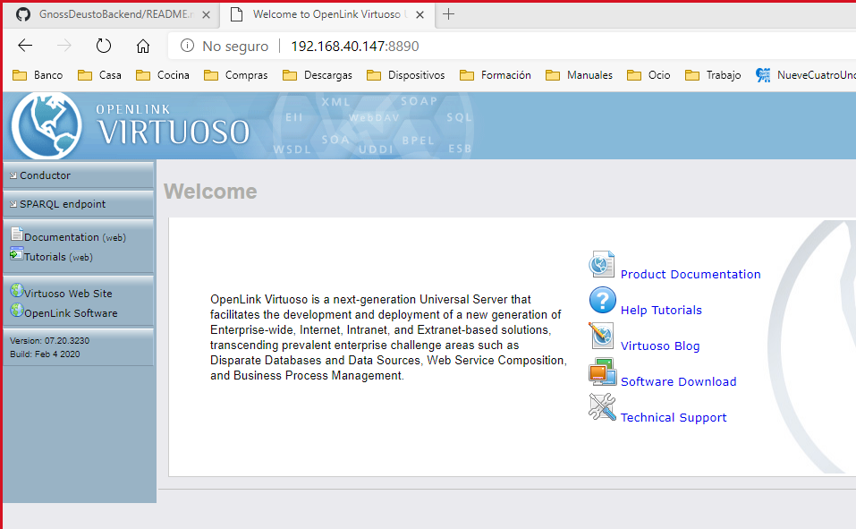
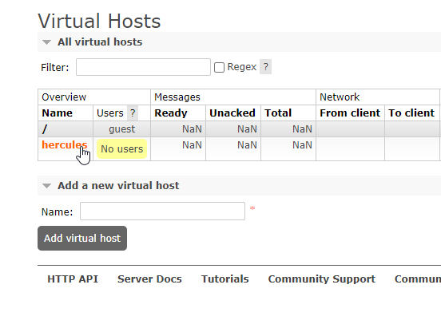

| Fecha         | 14/06/2021                                                   |
| ------------- | ------------------------------------------------------------ |
|Titulo|Despliegue de ASIO Backend de SGI con Docker| 
|Descripción|Instrucciones para instalar ASIO mediante el despliegue de instancias docker|
|Versión|1.5|
|Módulo|Documentación|
|Tipo|Manual|
|Cambios de la Versión|Añadidas instrucciones para reiniciar los frontales.|

## Índice
[Requisitos previos](#requisitos-previos)

[Despliegue de Virtuoso](#despliegue-de-virtuoso)

[Despliegue de PostgreSQL](#despliegue-de-postgresql)

[Despliegue de RabbitMQ](#despliegue-de-rabbitmq)

[Preparación de Apache](#preparación-de-apache)

 - [Limitar Apache](#limitar-apache)

[Despliegue de los servicios de back](#despliegue-de-los-servicios-de-back)

[Despliegue de los servicios front](#despliegue-de-los-servicios-front)

[Actualización y reinicio de los servicicios](#actualización-y-reinicio-de-los-servicicios)

[Ejemplo de configuración de HAProxy](#ejemplo-de-configuración-de-haproxy)

# Despliegue de ASIO Backend SGI con Docker

## Requisitos previos
En este manual recomendamos instalar algunos de los componenetes de ASIO mediante Docker. Para instalar con Docker el servidor debería tener instalado:  

* Docker (podemos seguir la documentacion oficial dependiendo de nuestra dristrubución de Linux) 
    - Centos https://docs.docker.com/engine/install/centos/
    - Ubuntu https://docs.docker.com/engine/install/ubuntu/
    - Debian https://docs.docker.com/engine/install/debian/
    
* docker-compose https://docs.docker.com/compose/install/  

* Acceso a http://curriculumpruebas.um.es/curriculum/rest/v1/auth desde la máquina donde vayamos a desplegar, si se quiere tener acceso al servicio de la UM que proporciona curriculum en formato CVN.

La arquitectura puede corresponder con un diagrama similar al siguiente (descrito en detalle en [Hércules ASIO Documento de alojamiento](../../Docs/Hercules-ASIO-Documento-de-Alojamiento.md)):

 
## Despliegue de Virtuoso

Como base de datos de triples vamos a utilizar Virtuoso. Para desplegarlo obtendremos el fichero YML con todas las configuraciones necesarias para su despliegue, desde este fichero podemos realizar varios ajustes para la configuración del contenedor y de Virtuoso. Las más importantes son las siguientes:
* DBA_PASSWORD: mysecret - Ajusta la clave para el usuario dba.
* VIRT_Parameters_NumberOfBuffers: 100000 - Nivel de buffer ajustado para 1 GB de RAM, para más RAM se incrementaria proporcionalmente.
* VIRT_Parameters_MaxDirtyBuffers: 60000 - Nivel de buffer ajustado para 1 GB de RAM, para más RAM se incrementaria proporcionalmente.
* VIRT_Parameters_MaxClientConnections: 100 - Máximo de conexiones por el puerto 1111.
* VIRT_HTTPServer_MaxClientConnections: 50 - Máximo de conexiones por el puerto 8890.

Partiendo desde la home del usurio (ej. /home/usuario/) creamos el directorio que va a contener el docker-compose.yml, entramos en el directorio, descargamos el fichero YML y levantamos el docker con los siguientes comandos: 

	mkdir virtuoso
	cd virtuoso
	wget https://raw.githubusercontent.com/HerculesCRUE/GnossDeustoBackend/master/Builds/docker-images/docs/docker-virtuoso/docker-compose.yml
	docker-compose up -d
	
Un vez desplegado podemos ver el proceso de docker con este comando:

	docker ps
	

Y podemos hacer una sencilla comprobación de que funciona entrando en la interfaz web con http://ip_de_nuestra_maquina:8890

Con esta configuración básica tendremos un interfaz sparql que se lanzará de manera anónima y con permisos exclusivamente de lectura. Para poder tener un interfaz sparql adicional con el que podamos hacer modificación de datos, lo primero que debemos hacer es acceder al interfaz isql de virtuoso entrando al docker.

	docker exec -it virtuoso bash
	cd ../bin/
	isql 1111 dba mysecret

Una vez aquí podremos ver esto:

Con estos comando creamos el usuario "UPDATE", le damos permisos, ajustamos lectura para nobody y modificación para "UPDATE":
	
	DB.DBA.USER_CREATE ('UPDATE', 'Bn4wQ6aD');
	grant SPARQL_SELECT to "UPDATE";
	grant SPARQL_UPDATE to "UPDATE";
	grant SPARQL_SPONGE to "UPDATE";	
	DB.DBA.RDF_DEFAULT_USER_PERMS_SET ('nobody', 1);
	DB.DBA.RDF_DEFAULT_USER_PERMS_SET ('UPDATE', 3);
	
Ahora solamente necesitamos añadir un interfaz que sea autenticado y ejecutado por UPDATE con el que se puedan hacer modificaciones. Para ello accedemos a http://ip_de_nuestra_maquina:8890/conductor y hacemos login con el usuario dba (en esta guía dba / mysecret). A continuación vamos a la sección indicada en la captura:

Una vez ahí desplegamos el interfaz 0.0.0.0:8890 y buscamos el /sparql-auth

Y lo editamos para dejarlo de la siguiente manera (con modificar el Realm y poner UPDATE sería suficiente):

Ahora si vamos a http://ip_de_nuestra_maquina:8890/sparql-auth y nos autenticamos con el usuario "UPDATE" podremos hacer modificaciones a través de esa interfaz.
	
## Despliegue de PostgreSQL

El procedimiento para desplegar PostgreSQL es similar al de Virtuoso. Utilizaremos docker-compose con su respectivo YML. En esta plantilla no es necesario ajustar nada aunque podemos establecer el password que queramos en el parámetro "POSTGRES_PASSWORD" del fichero docker-compose.yml, cosa que tenemos que tener en cuenta a la hora de ajustar el YML de los servicios que veremos más adelante.

Partiendo desde la home del usurio (ej. /home/usuario/) creamos el directorio que va a conetener el docker-compose.yml, entramos en el directorio, descargamos el yml y levantamos el docker con los siguientes comandos: 

	mkdir postgresql
	cd postgresql
	wget https://raw.githubusercontent.com/HerculesCRUE/GnossDeustoBackend/master/Builds/docker-images/docs/docker-postgresql/docker-compose.yml
	docker-compose up -d
	
Después de desplegar, como en el caso anterior, vamos a hacer la comprobación de que el contenedor está levantado pero en esta ocasión vamos a usar el comando docker-compose ps que se limita a mostrar información solo de los procesos de este yml.
	
	docker-compose ps
	

## Despliegue de RabbitMQ

RabbitMQ lo desplegaremos con la misma mecánica que en los dos casos anteriores.

Partiendo desde la home del usurio (ej. /home/usuario/) creamos el directorio que va a conetener el docker-compose.yml, entramos en el directorio, descargamos el YML y levantamos el docker con los siguientes comandos: 
	
	mkdir rabbitmq
	cd rabbitmq
	wget https://raw.githubusercontent.com/HerculesCRUE/GnossDeustoBackend/master/Builds/docker-images/docs/docker-rabbitmq/docker-compose.yml
	docker-compose up -d
	
Una vez levantado podemos hacer la comprobación de que esta el contenedor levantado con este comando:

	docker-compose ps

Y podemos probar a cargar el interfaz web de rabbitmq con http://ip_de_nuestra_maquina:15672 y ver como nos sale la pantalla de login.

Ahora debemos hacer login con usurio "guest" y password "guest", que son los que vienen por defecto aunque los podemos cambiar más adelante. Ya logueados vamos a la sección "Admin" y hacemos clik en "users".

Hacemos clik en "add user, añadimos el nombre de usuario, en nuestos ejemplo "hercules" y una pass. Después hacemos clik "add user" de nuevo.

El siguiente paso es añadir un virtual host para nuestro proyecto. En este ejemplo o llamaremos "hercules". Para ello vamos a la sección "Virtual host", escribimos el nombre y lo añadimos.

Una vez añadido entramos en sus ajustes.

Le damos permisos al usuario que acabamos de creqar. En nuestro caso "hercules".

Y vemos como han aplicado correctamente estos permisos.

Ya tenemos RabbitMQ listo para trabajar en nuestro entorno.

## Preparación de Apache

La instalación de Apache la podemos hacer desde los repositorios de nuestro sistema operativo. En este ejemplo podemos ver como instalar Apache, junto al módulo SSL en Centos o Red Hat.

	yum -y install httpd mod24_ssl
	
En Centos o RHEL necesitamos ejecutar este comando para que Apache pueda realizar conexiones y así pueda funcionar de proxy inverso:

	/usr/sbin/setsebool -P httpd_can_network_connect 1
	
Si lo queremos instalar en Ubuntu o Debian debemos ejecutar los siguientes comandos:

	apt-get update
	apt-get install apache2 openssl
	a2enmod ssl
	a2enmod proxy
	a2enmod proxy_http
	a2enmod proxy_balancer
	a2enmod lbmethod_byrequests

Para que el Linked Data Server funcione de manera adecuada tenemos que preparar un archivo de configuracion de Apache con estos datos. Esta configuración hace basicamente que lo que se pida por http se re dirija al servidor de Linked Data Server que en este caso estaria en la misma máquina y en su puerto establecido "8081"

	<VirtualHost *:80>
    		ServerName linkeddata2test.um.es
		DocumentRoot "/var/www/html"
    		ProxyPreserveHost On
    		ProxyPass / http://127.0.0.1:8081/
    		ProxyPassReverse / http://127.0.0.1:8081/
    		Timeout 5400
    		ProxyTimeout 5400
    		<Proxy *>
        		Order deny,allow
        		Allow from all
        	Require all granted
    		</Proxy>
	</VirtualHost>

Si usamos Apache en Ubuntu deberemos activar el sitio por defecto ssl con este comando:

	s2ensite default-ssl

Ahora debemos añadir estas líneas a la configuración ssl. En RHEL lo encontraremos en "/etc/httpd/conf.d/ssl.conf", en Ubuntu "/etc/apache2/sites-enabled/default-ssl.conf".

	ServerName linkeddata2test.um.es:443

	#APIFRONTCARGA
	ProxyPass /carga-web http://ip_del_servicio:5103
	ProxyPassReverse /carga-web http://ip_del_servicio:5103

	#APICARGA
	ProxyPass /carga http://ip_del_servicio:5100
	ProxyPassReverse /carga http://ip_del_servicio:5100

	#BENCHMARK
	ProxyPass /benchmark http://ip_del_servicio:8401
	ProxyPassReverse /benchmark http://ip_del_servicio:8401

	#OAI-PMH-CVN
	ProxyPass /oai-pmh-cvn http://ip_del_servicio:5102
	ProxyPassReverse /oai-pmh-cvn http://ip_del_servicio:5102

	#CRON
	ProxyPass /cron-config http://ip_del_servicio:5107
	ProxyPassReverse /cron-config http://ip_del_servicio:5107

	#DOCUMENTACION
	ProxyPass /documentacion http://ip_del_servicio:5109
	ProxyPassReverse /documentacion http://ip_del_servicio:5109

	#IDENTITY-SERVER
	ProxyPass /identityserver http://ip_del_servicio:5108
	ProxyPassReverse /identityserver http://ip_del_servicio:5108

	#APIURIS
	ProxyPass /uris http://ip_del_servicio:5000
	ProxyPassReverse /uris http://ip_del_servicio:5000

	#XMLRDFCONVERSOR
	ProxyPass /conversor_xml_rdf http://ip_del_servicio:5114
	ProxyPassReverse /conversor_xml_rdf http://ip_del_servicio:5114

	#UNIDATA
	ProxyPass /unidata http://ip_del_servicio:5106
	ProxyPassReverse /unidata http://ip_del_servicio:5106

	#CVN
	ProxyPass /cvn http://ip_del_servicio:5104
	ProxyPassReverse /cvn http://ip_del_servicio:5104
	ProxyPass /cvn_swagger http://ip_del_servicio:8080
	ProxyPassReverse /cvn_swagger http://ip_del_servicio:8080  

	#BRIDGE
	ProxyPass /fairmetrics_bridge http://ip_del_servicio:5200
	ProxyPassReverse /fairmetrics_bridge http://ip_del_servicio:5200
	ProxyPass /bridgeswagger http://ip_del_servicio:8082
	ProxyPassReverse /bridgeswagger http://ip_del_servicio:8082

	#VIRTUOSO1
	ProxyPass /sparql http://ip_del_servicio:8890/sparql
	ProxyPassReverse /sparql http://ip_del_servicio:8890/sparql

	#VIRTUOSO2
	ProxyPass /sparql2 http://ip_del_servicio:8890/sparql
	ProxyPassReverse /sparql2 http://ip_del_servicio:8890/sparql

Por último, para que la aplicación disponga de los archivos necesarios tenemos que subir estos estilos en la capeta publica de Apache.

	wget https://github.com/HerculesCRUE/GnossDeustoBackend/tree/master/Builds/docker-images/docs/contenido.tar.gz

###### Limitar Apache

Si queremos poner límitees de ancho de banda o de conexiones por IP de nuestro Apache, debemos instalar los módulos mod_limitipconn y mod_bw siguiendo las instrucciones que vienen a continuación. Antes de comenzar debemos tener los *devel* de Apache instalados. 
En RHEL:

	yum -y install httpd-devel
	
En Ubuntu:

	apt install apache-devel

Descargamos los módulos en la ruta que queramos:

	wget http://dominia.org/djao/limit/mod_limitipconn-0.24.tar.bz2  
	wget http://ivn.cl/files/source/mod_bw-0.92.tgz  

Descomprimimos e instalamos:

	tar xvf mod_limitipconn-0.24.tar.bz2
	cd mod_limitipconn-0.24  
	sudo apxs -c -i -a mod_limitipconn.c  
	cd ..  
	tar xvf mod_bw-0.92.tgz  
	
Para poder el segundo módulos debemos editar el archivo mod_bw.c y sustituir remote_addr por client_addr (tres ocurrencias). Una vez hecho esto podemos instalarlo:

	apxs -c -i mod_bw.c 

Para activar los módulos debemos editar el httpd.conf y añadir estas dos líneas:

	ExtendedStatus On
	LoadModule limitipconn_module modules/mod_limitipconn.so
	LoadModule bw_module modules/mod_bw.so

Ahora podemos establecer límites en nuestros sitios de Apache. A continuacón podemos ver un ejemplo:

	BandwidthModule On // Abrir mod_bw  
 	ForceBandWidthModule On // Igual que el anterior  
 	LargeFileLimit .rar 1 100000 // Limite todos los archivos rar para descargar 100K por segundo  
 	MaxConnPerIP 2 // Como máximo dos conexiones por IP  
 	NoIPLimit image / * // Sin restricción de conexión IP en archivos de imagen

Estos dos módulos son bastante potentes y podemos ver mas configuraciones en los siguientes enlaces:

	https://svn.apache.org/repos/asf/httpd/sandbox/mod_bw/mod_bw.txt
	https://dominia.org/djao/limitipconn2-README

## Despliegue de los servicios de back

Para simplificar el despliegue de los servicios de back, hemos creado un script que debemos descargar en nuestra máquinas para servicios de back. Partiendo desde la home del usurio (ej. /home/usuario/).
	
	wget https://raw.githubusercontent.com/HerculesCRUE/GnossDeustoBackend/master/Builds/docker-images/docs/docker-servicios-back/actualizar_back.sh
	
Este script clonará los repositorios necesarios y luego generará las imágenes docker automáticamente. Le debemos dar permisos de ejecución.

	chmod +x actualizar_back.sh

Después creamos el directorio donde vamos a alojar el docker-compose.yml que va orquestar todos los servicios. Lo hemos llamado dock-back porque en el script actualizar_back.sh así se llama, pero podríamos cambiar estos valores. Después lo descargamos.

	mkdir dock-back
	cd dock-back
	wget https://raw.githubusercontent.com/HerculesCRUE/GnossDeustoBackend/master/Builds/docker-images/docs/docker-servicios-back/docker-compose.yml
	
Antes de levantar los servicios debemos editar este archivo y reemplazar "ip_del_servicio" por la ip de la máquina donde estemos levantando los servicios, para que todos los servicios se puedan comunicar correctamente entre ellos.

También debemos indicar las conexiones a PostgreSQL y RabbitMQ que hayamos determinado anteriormente.

**NOTA**: Si fuésemos a usar un interfaz SPARQL distinto al indicado en este ejemplo deberíamos modificar los parametros de SPARQL Endpoint para que apunten al servidor RDF instalado. 

Con la ip ajustada ya podemos ejecutar el script que nos prepara el entorno.

	./actualizar_back.sh

## Despliegue de los servicios front

Para simplificar el despliegue de los servicios de front, hemos creado un script que debemos descargar en la máquina donde queramos alojar los servicios de front. Partiendo desde la home del usurio (ej. /home/usuario/).

	wget https://raw.githubusercontent.com/HerculesCRUE/GnossDeustoBackend/master/Builds/docker-images/docs/docker-servicios-front/actualizar_front.sh
	
Este script clonará los repositorios necesarios y luego generará las imágenes docker automáticamente. Le debemos dar permisos de ejecución.

	chmod +x actualizar_front.sh

Después creamos el directorio donde vamos a alojar el docker-compose.yml que va orquestar todos los servicios. Lo hemos llamado dock-front porque en el script actualizar_fron.sh se llama así, pero podríamos cambiar con estos valores. Después lo descargamos.

	mkdir dock-front
	cd dock-front
	wget https://raw.githubusercontent.com/HerculesCRUE/GnossDeustoBackend/master/Builds/docker-images/docs/docker-servicios-front/docker-compose.yml
	
Antes de levantar los servicios debemos editar este archivo y reemplazar "ip_del_servicio" por la IP de la máquina donde estemos levantando cada servicio. Haríamos lo mismo con todos los servicios para que se puedan comunicar correctamente entre ellos.

También debemos indicar las conexiones a PostgreSQL y RabbitMQ que hayamos determinado anteriormente.	

**NOTA**: Si fuésemos a usar un interfaz SPARQL distinto al indicado en este ejemplo deberíamos modificar los parametros de SPARQL Endpoint para que apunten al servidor RDF instalado.

Con las IPs ajustadas ya podemos ejecutar el script que nos prepara el entorno.

	./actualizar_front.sh
	
Cuando accedamos por primera vez el frontal web nos debería fallar porque aún falta la carga en BBDD de las vistas personalizadas. Para conseguir esto tenemos que hacer estos pasos:

Primero nos bajamos un script SQL con los INSERT necesarios desde la máquina donde tenemos PostgreSQL instalado.

	wget https://raw.githubusercontent.com/HerculesCRUE/GnossDeustoBackend/master/Builds/docker-images/docs/docker-postgresql/vistas.sql
	
Ahora tenemos que modificar los INSERT ajustando los enlaces http y https y poner los adecuados para nuestro entorno.

Una vez modificado el script tenemos que ejecutar estos comandos:

	docker cp vistas.sql postgresql_db_1:/vistas.sql

	docker exec -it postgresql_db_1 bash

	su postgres

	psql -f vistas.sql

Si todo ha ido bien veremos el recuento de los inserts con este formato:

	INSERT 0 14

Ahora, si accedemos a http://ip_de_nuestra_maquina:5103 podemos ver el interfaz web para poder hacer cargas.

## Actualización y reinicio de los servicicios

Si queremos actualizar los servicios o reiniciarlos por algún mal funcionamiento, debemos ejecutar los script de despliegues que hemos mencionado en apartados anteriores en su correspondiente frontal. Se trata por tanto de ejecutar los siguientes scripts:

	./actualizar_front.sh
	./actualizar_back.sh

Si los servicios de front estuvieran en alta disponibilidad sería recomendable ejecutar el script de front en los dos, aunque solamente tuviéramos el problema en uno, debido a que este proceso actualiza además de reiniciar.

## Ejemplo de configuración de HAProxy

Para implementar la alta disponibilidad tanto de los frontales web, como de Virtuoso podemos colocarlos duplicados detrás de un HAProxy, como se ilustra en la siguiente imagen y se explica en el apartado de [Elementos de alta disponibilidad](../../Docs/Hercules-ASIO-Documento-de-Alojamiento.md#324-elementos-en-alta-disponibilidad) del "Documento de alojamiento".

Aquí podemos ver un ejemplo de configuración:

	defaults
	    mode                    http
	    log                     global
	    option                  httplog
	    option                  dontlognull
	    option http-server-close
	    option forwardfor       except 127.0.0.0/8
	    option                  redispatch
	    retries                 3
	    timeout http-request    10s
	    timeout queue           1m
	    timeout connect         10s
	    timeout client          1m
	    timeout server          1m
	    timeout http-keep-alive 10s
	    timeout check           10s
	    maxconn                 3000

	#WEB

	listen hercules443
	    bind ip_del_haproxy:443
	    mode tcp
	    option tcplog
	    option redispatch
	    option clitcpka
	    option srvtcpka
	    option tcpka
	    timeout client 3s
	    retries 2
	    balance roundrobin 
	    hash-type consistent
	    stick-table type ip size 1m expire 1h
	    stick on src
	    timeout connect 3s
	    timeout server 3s
	    server nodo1 ip_del_nodo1_web:443 check inter 3s fall 1 rise 2
	    server nodo2 ip_del_nodo2_web:443 check inter 3s fall 1 rise 2

	listen hercules:80
	    bind ip_del_haproxy:80
	    mode tcp
	    option tcplog
	    option redispatch
	    option clitcpka
	    option srvtcpka
	    option tcpka
	    timeout client 3s
	    retries 2
	    balance roundrobin
	    hash-type consistent
	    stick-table type ip size 1m expire 1h
	    stick on src
	    timeout connect 3s
	    timeout server 3s
	    server nodo1 ip_del_nodo1_web:80 check inter 3s fall 1 rise 2
	    server nodo2 ip_del_nodo1_web:80 check inter 3s fall 1 rise 2

	#VIRTUOSO

	listen VirtuosoLecturaProGnoss
	    stats enable
	    bind ip_del_haproxy:8890
	    option forwardfor except 127.0.0.0/8
	    mode http
	    balance roundrobin
	    option httpclose
	    option redispatch
	    retries 2
	    option forwardfor
	    option httpchk HEAD /sparql
	    http-check expect status 200
	    http-response add-header X-App-Server %b_%s
	    server v1pro v1pro:8890 check inter 3s fall 1 rise 2 
	    server v2pro v2pro:8890 check inter 3s fall 1 rise 2 

	listen VirtuosoLecturaProGnoss1111
	    bind ip_del_haproxy:1111
	    mode tcp
	    option tcplog
	    option redispatch
	    option clitcpka
	    option srvtcpka
	    option tcpka
	    timeout client 3s
	    retries 2
	    balance source
	    hash-type consistent
	    stick-table type ip size 1m expire 1h
	    stick on src
	    timeout connect 3s
	    timeout server 3s   
	    server v1pro v1pro:1111 check inter 3s fall 1 rise 2 
	    server v2pro v2pro:1111 check inter 3s fall 1 rise 2 

	#STATS

	listen stats
	    bind *:9999
	    stats enable
	    stats uri /stats
	    stats auth admin:admin

En el bloque web podemos ver dos front, uno por el puerto 80 y el otro por el 443 que deben apuntar a los frontales web.

En el bloque Virtuoso, tenenos dos front (1111 y 8890) que apuntan a los dos Virtuosos.

Para que este sistema funcione correctamente debemos añadir a la resulución de nombres de la máquina (/etc/hosts) las siguientes líneas:

	ip_virtuoso_1 v1pro
	ip_virtuoso_2 v2pro
