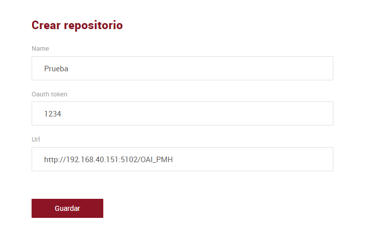
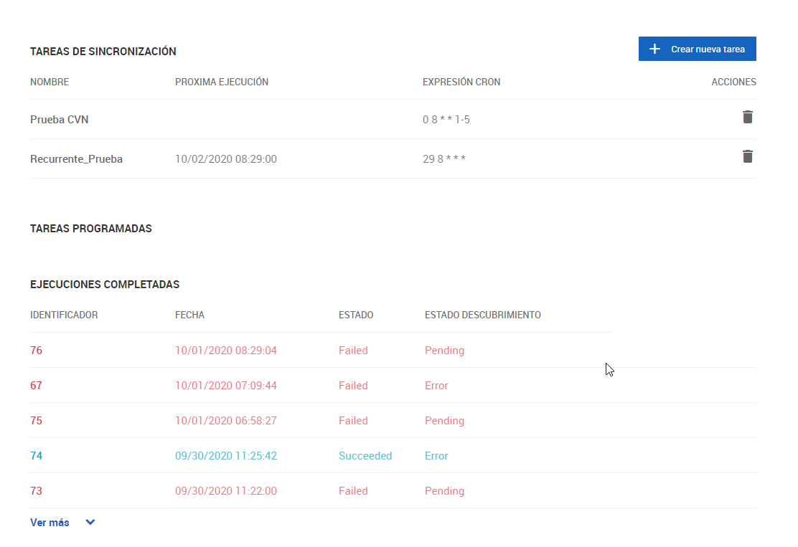
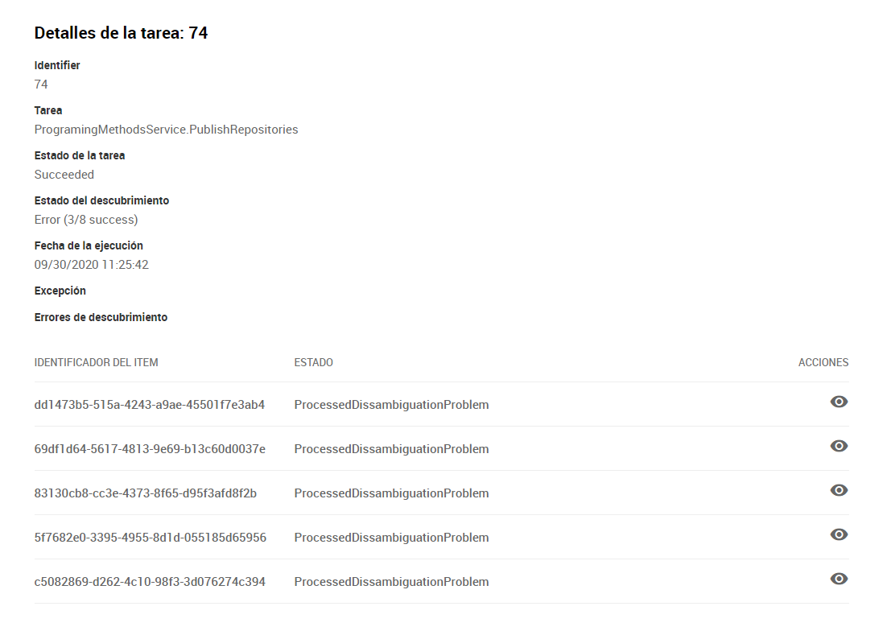
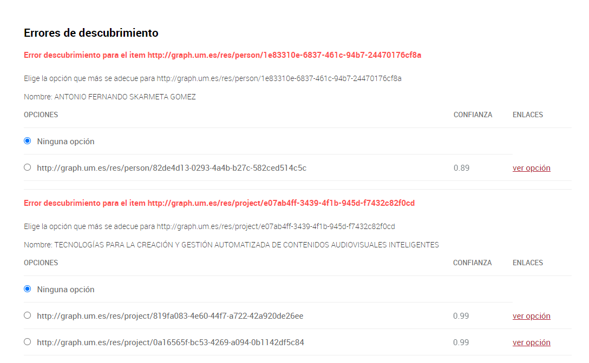
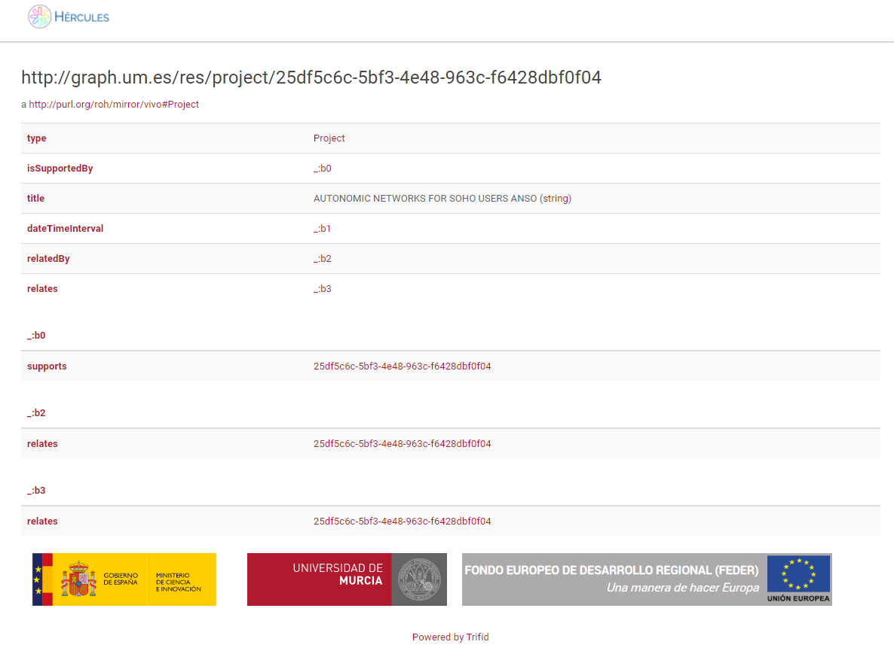

| Fecha         | 01/10/2020                                                   |
| ------------- | ------------------------------------------------------------ |
|Titulo|Prueba del entorno y carga inicial| 
|Descripción|Manual de pruebas para la revisión y carga de datos inicial despues del despliegue. Entrega parcial de octubre de 2020. Pendiente de actualizar para la entrega final|
|Versión|0.1|
|Módulo|Despliegue|
|Tipo|Manual|
|Cambios de la Versión|Creación|

# Hércules ASIO Backend SGI. Prueba del entorno y carga inicial

Como primer paso para la carga inicial, hay que realizar una modificación en el host de la maquina desde la que estemos accediendo, añadiendo en una nueva linea el dominio graph.um.es y que el mismo responda de la IP de la maquina dodne hemos instalado el servicio de trifid.

Una vez desplegados y configurados todos los contenedores, como se indica en el documento [Despliegue del backend con Docker](https://github.com/HerculesCRUE/GnossDeustoBackend/tree/master/docker-images), podemos realizar las pruebas necesarias para comprobar todos los servicios están respondiendo correctamente, para ello accederemos vía el interfaz web y realizaremos una carga inicial, y comprobaremos en virtuoso que los datos se hayan obtenido correctamente. 

El primer paso es acceder a la interfaz web de los servicios dados de alta, por ejemplo: http://ip_de_nuestra_máquina:5103, todas las funcionalidades disponibles en el interfaz web se detallan en el documento [Manual de usuario del FrontEnd de Carga](../src\Hercules.Asio.Web/Manual-de-usuario.md#administraci%C3%B3n-de-p%C3%A1ginas)

Comprobamos que podemos acceder al endpoint de virtuoso accediendo a http://ip_de_nuestra_máquina:8089/sparql y comprobamos que no hay cargado ningún dato con la siguiente con la siguiente consulta:
```
select * from <http://HerculesDemo.com> where

 {

      ?s a <http://purl.org/roh/mirror/foaf#Person>

 }
```

Esta consulta no nos tiene que devolver ningún resultado.

Posteriormente creamos un nuevo repositorio, para ello pulsamos en el botón de añadir en la parte derecha y seguimos estos pasos:


* Completamos el campo Name con el nombre que queramos para el repositorio por ejemplo Prueba_CVN
* El Oauth token lo completamos con el código que queramos
* En la url introducimos la URL o IP y puerto que hemos configurado para el servicio apiOAIPMH
* Pulsamos en Guardar

Una vez creado el repositorio accedemos al mismo pulsando en el nombre, al acceder nos mostrara los datos que hemos proporcionado para la configuración del repositorio, el porcentaje de las tareas lanzadas que se ha ejecutado de forma correcta, cual ha sido la última tarea ejecutada y si ha sido ejecutada correctamente. Además podemos comprobar las configuraciones de validación de los RDF's del repositorio pulsando en el enlace *Ver validaciones* o bien en el enlace *Shapes* en la cabecera.


Cuando finalizemos procederemos a realizar la sincronización inicial del repositorio con los RDF's, para ello pulsando en Sincronizar.

Al realizar esta acción estamos generando una tarea que obtiene los RDF's y los carga en la base de datos RDF, 

Para comprobar que se han cargado correctamente volvemos a acceder al endpoint de virtuoso y realizamos la siguiente consulta:
```
select * from <http://HerculesDemo.com> where

 {

      ?s a <http://purl.org/roh/mirror/foaf#Person>.

      ?s <http://purl.org/roh/mirror/foaf#name> ?nombre

 }
```

Esta consulta nos tendria que devolver los datos de los RDF's cargados

Posteriormente vamos a añadir una tarea para que sincronice periódicamente los RDF's, volvemos a la página principal del repositorio y navegamos por la página hacia abajo hasta encontrar el apartado "Tareas de sincronización", aquí podemos ver las tareas configuradas así como cuando van a ejecutarse de nuevo y cuál es la configuración del cron para la periodicidad de ejecución, podemos comprobar el valor haciendo uso de esta página: https://crontab.guru/ en la cual podemos introducir los valores configurador en el cron para ver a que periodicidad corresponden.


Para añadir una nueva tarea, pulsamos en Crear nueva tarea y seguimos estos pasos:

* Indicamos la fecha inicial en la que se va a ejecutar la tarea: por ejemplo en el dia siguiente al que estamos
* En la fecha de ultima sincronización indicamos la fecha desde la que queremos que se empiecen a sincronizar los RDF's
* En caso de que queramos sincronizar ciertos objetos y los RDF's que los contienen, indicamos aquí los objetos
* En caso de que queramos sincronizar un objeto concreto indicamos su código

Si queremos que la tarea se ejecute periódicamente, tenemos que completar también los campos siguientes:
* Indicamos el nombre de la tarea para poder identificarla, por ejemplo: Sincronización semanal
* La expresión cron indica cada cuanto se va a ejecutar la tarea, para validar que la expresión es correcta y se ejecuta cuando queremos, podemos ayudarnos de esta web: https://crontab.guru/ por ejemplo para que se ejecute los martes a las 08:10 seria la siguiente: 10 8 * * 2


Por último, hacemos clic en Guardar para crear la tarea

Cuando accedamos de nuevo al repositorio, nos mostrara la tarea en el listado de "Tareas de sincronización"

Para comprobar las ejecuciones y su estado, accedemos al repositorio y navegamos hasta el apartado "Tareas Programadas", dentro del apartado "Ejecuciones completadas", disponemos de un listado de las ejecuciones realizadas con su identificador, fecha de realización de la sincronización, estado y estado del descubrimiento. Si pulsamos en el identificador correspondiente a la tarea que queramos revisar, nos llevara a una descripción detallada del resultado de la sincronización



En caso de que haya algun error nos mostrara el mismo y podemos acceder a ver el detalle correspondiente pulsando en el icono de la columna acciones



Nos mostrara una lista indicandonos que errores se han detectado y las opciones para solventarlos, generalmente estos errores son debidos a que ya existe la entidad en la base de datos y nos da la opción de cargarla asociandolo a dicha entidad ya creada, si pulsamos en "Ver opción", podremos comprobar los datos correspondiente a la entidad para asegurarnos de que sea la correcta




Cuando seleccionemos que acción realizar para cada uno de los errores pulsamos en validar para confirmar los cambios que se llevaran a cabo.
