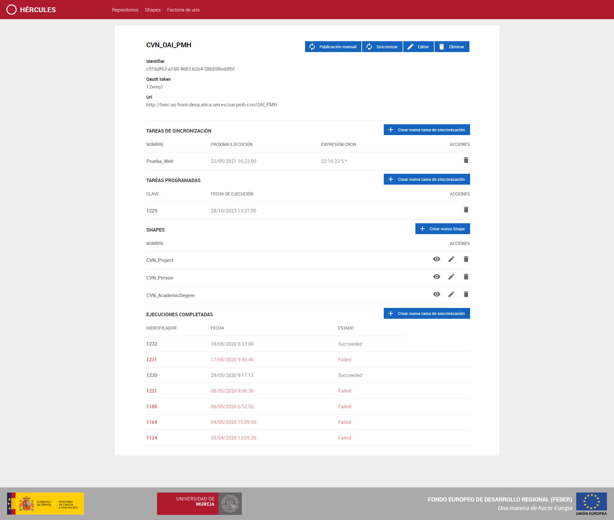
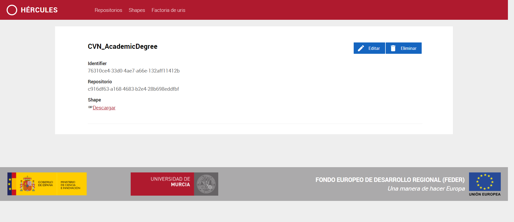
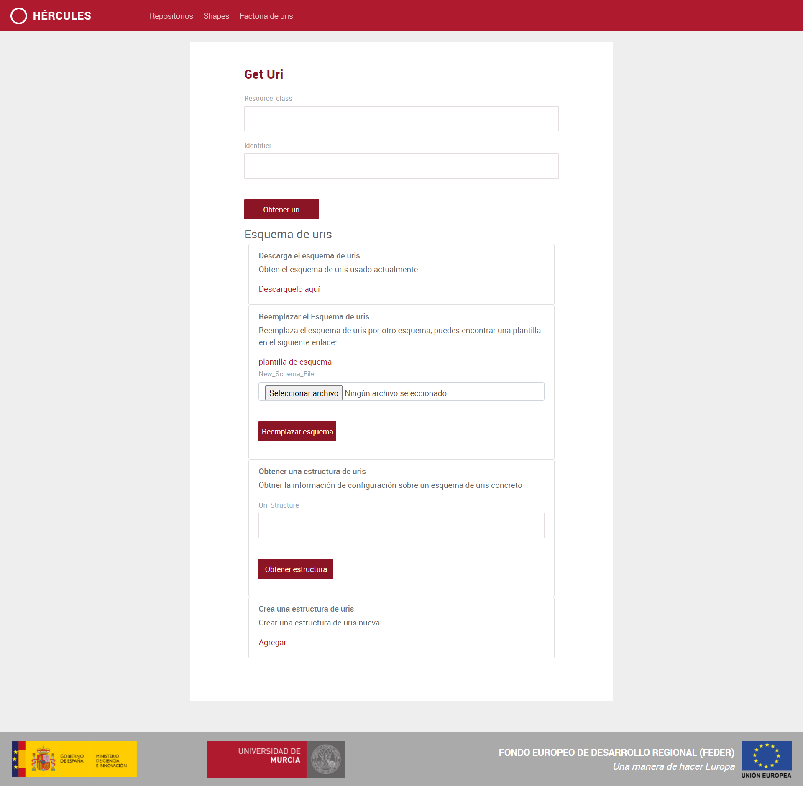
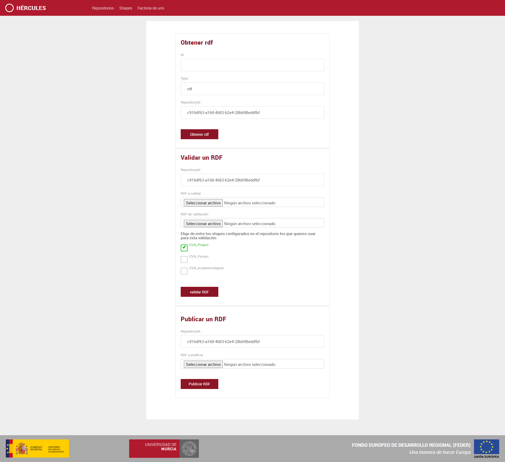
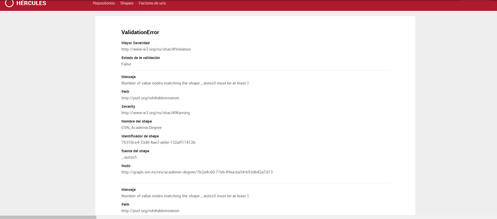

 
# Manual de usuario del FrontEnd de Carga

[Introducción](#introduccion)

[Página principal. Listado de repositorios](#página-principal-listado-de-repositorios)

[Vista de una tarea](#vista-de-una-tarea)

[Vista de una tarea recurrente](#vista-de-una-tarea-recurrente)

[Listado de validaciones](#listado-de-validaciones)

[Factoría de URIs](#factoría-de-uris)

[Publicación y validación de rdf](#publicacion-y-validacion-de-rdf)

Introducción
------------
Está web es el punto de entrada de los usuarios para administrar sus repositorios. Desde una interfaz intuitiva podrán dar de alta nuevos repositorios, administrarlos y eliminarlos. La primera página que se le muestra al usuario es el listado de repositorios existentes. 

Para cada repositorio el usuario podrá añadir validaciones, tareas programadas y tareas recurrentes. 

Además, desde el menú superior puede acceder también al listado de validaciones (shapes) y a la administración de la factoría de uris, desde donde se podrá administrar los esquemas de URIs. 

Página principal. Listado de repositorios
-----------------------------------------

La página de inicio de la web es el listado de los repositorios. Un repositorio es un origen de datos para ASIO.
Desde este listado se puede crear un repositorio nuevo con el botón "+" que se encuentra por la mitad de la página. 

Al acceder a un repositorio podemos ver las validaciones que tiene vinculados ese repositorio, 
así como las tareas de sincronización programadas y el histórico de sincronizaciones ejecutadas que ha tenido, 
como se muestra a continuación. 

Desde esta pantalla se pueden crear nuevos validaciones asociados al repositorio y nuevas 
sincronizaciones. Además se puede editar o eliminar el repositorio y modificar la
información asociada a él (validaciones y tareas):
 - Modificar shape.
 - Eliminar shape.
 - Eliminar tarea programada.
 - Eliminar tarea recurrente.

También se puede acceder a la información de las tareas, tanto de tareas de ejecución
única como de tareas recurrentes, como se muestra en los apartados siguientes.

Vista de una tarea
------------------

Se denomina una tarea a la programación de una sincronización de un repositorio. Cuando está sincronización 
se realiza, esta tarea pasa a ser una tarea ejecutada. 

En la pantalla que se muestra a continuación se muestran los datos de una tarea ejecutada
y un botón con el cual se puede volver a lanzar. Los datos mostrados son:
 - Identificador de la tarea.
 - La tarea ejecutada.
 - El estado de la tarea, que puede ser que se haya ejecutado con éxito o esté en estado fallido.
 - La fecha de la ejecución en formato UTC.
 - Error que haya causado el fallo de la tarea.
 

Vista de una tarea recurrente
-----------------------------

Cuando se habla de una tarea recurrente, se habla de una programación de sincronización sobre un repositorio que 
tiene una repetición a lo largo del tiempo, esta repetición o recurrencia viene dada por la expresión del cron
configurada en esta tarea recurrente.
En la siguiente imágen se muestran los datos de una tarea recurrente:
 - El nombre de la tarea recurrente.
 - La expresión del cron que indica la recurrencia de dicha tarea.
 - La fecha de la próxima ejecución.
 - El identificador de la última tarea ejecutada, en el caso de que se haya ejecutado alguna tarea.
 - El estado de la última tarea ejecutada, en el caso de que se haya ejecutado alguna tarea.
 - Por último se muestra un listado de las tareas ejecutadas a partir de la tarea recurrente.
 

Listado de validaciones
-----------------

Para obtener más información de los validaciones puedes consultar: https://github.com/HerculesCRUE/GnossDeustoBackend/tree/master/API_CARGA/Validaciones
Desde esta página se muestra el listado general de validaciones. Desde este listado se puede acceder al detalle de una validación concreta. 

Para poder acceder a su información y poder editarla o eliminar el shape tendremos que acceder a él.

Factoría de URIs
----------------

Para acceder a la información explicativa sobre las uris y el esquema de uris se puede acceder desde: https://github.com/HerculesCRUE/GnossDeustoBackend/tree/master/UrisFactory
Interfaz desde la que se puede:
 - Obtener un URI.
 - Descargar el archivo el archivo de configuración de los URIs.
 - Reemplazar el archivo de configuración de URIs.
 - Eliminar una estructura de URIs.
 - Añadir una nueva estructura de URIs.
 
 
 
 A la hora de crear una estructura URI nos mostrará un texto editable en el que aparece una
 estructura a modo de ayuda, como se ve en la siguiente imágen:
 

Publicación y validación de rdf
----------------
A esta interfaz se accede desde la vista de detalles de un repositorio, desde la parte superior donde aparece la opción publicación manual.
Desde esta interfaz se puede: 
 - Obtener el rdf de un repositorio.
 - Validar un rdf propio o descargado del propio repositorio, tanto por medio de un rdf de validación propio como por los shapes configurados en el propio repositorio.
 - Publicar un rdf, pasando antes por los sahpes configurados en el repositorio.
Cuando se obtenga un error de validación se mostrará una página de error como la que aparece a continuación.

Interfaz:

Error de validación:

