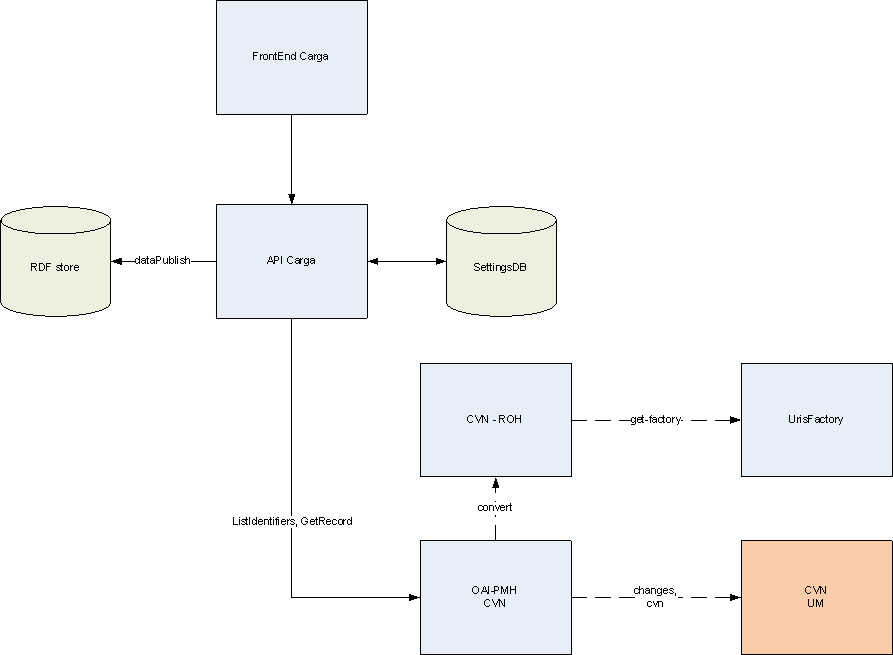

## Sobre GnossDeustoBackend
Éste es el repositorio del proyecto Hércules ASIO en el que se incluiyen los siguientes programas y servicios

 - [API_CARGA](https://github.com/HerculesCRUE/GnossDeustoBackend/tree/master/API_CARGA "API_CARGA"): Servicio web que realiza las tareas de carga/configuración.
 - [FrontEndCarga](https://github.com/HerculesCRUE/GnossDeustoBackend/tree/master/FrontEndCarga "FrontEndCarga"): Interfaz web para la parte de Repository y Validation del API_CARGA
 - [OAI_PMH_CVN](https://github.com/HerculesCRUE/GnossDeustoBackend/tree/master/OAI_PMH_CVN "OAI_PMH_CVN"): Servicio OAI-PMH para la obtención de invstigadores de la Universidad de Murcia.
 - [UrisFactory](https://github.com/HerculesCRUE/GnossDeustoBackend/tree/master/UrisFactory "UrisFactory"): Servicio que genera las uris de los recursos
 
 ### Diagrama de componentes del proyecto:
 

[]
