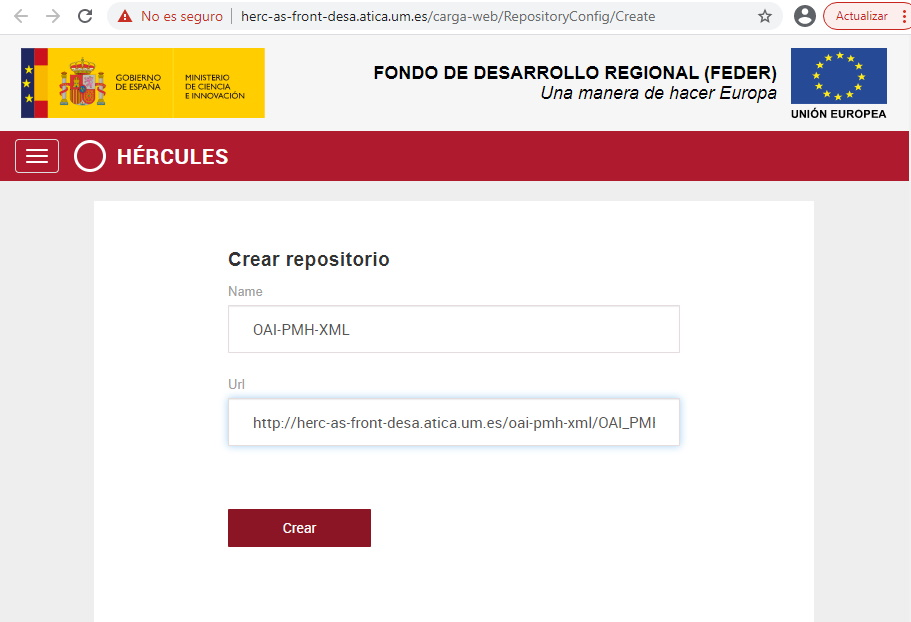
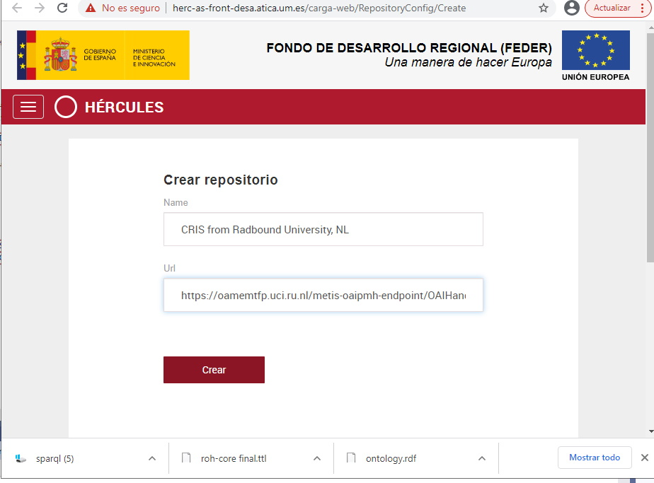
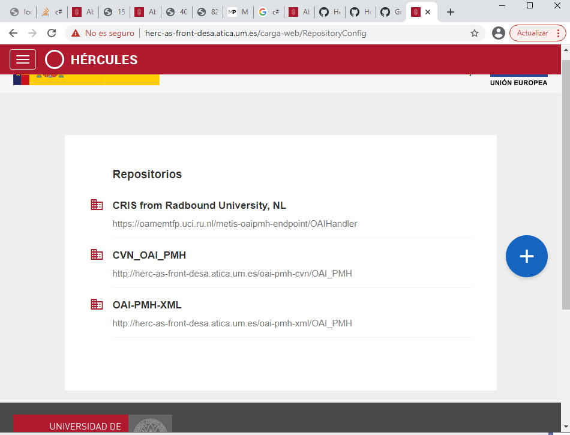
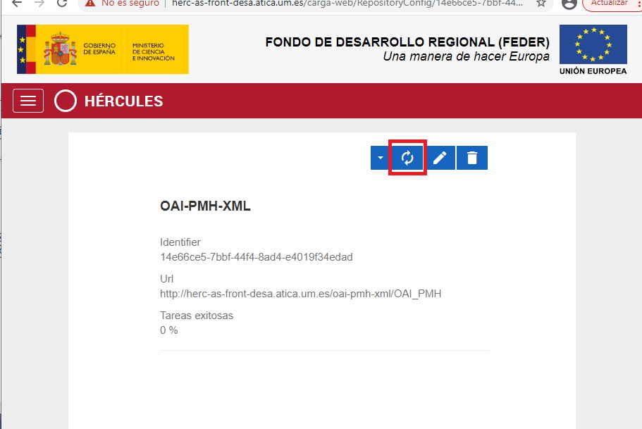
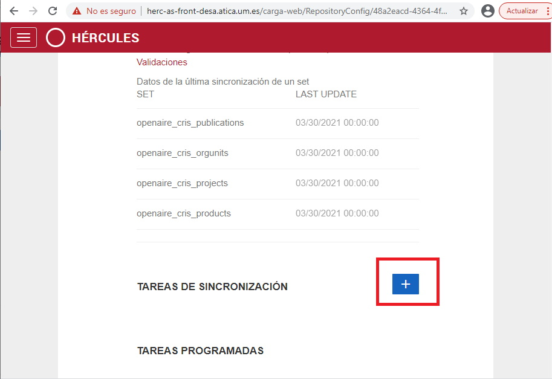
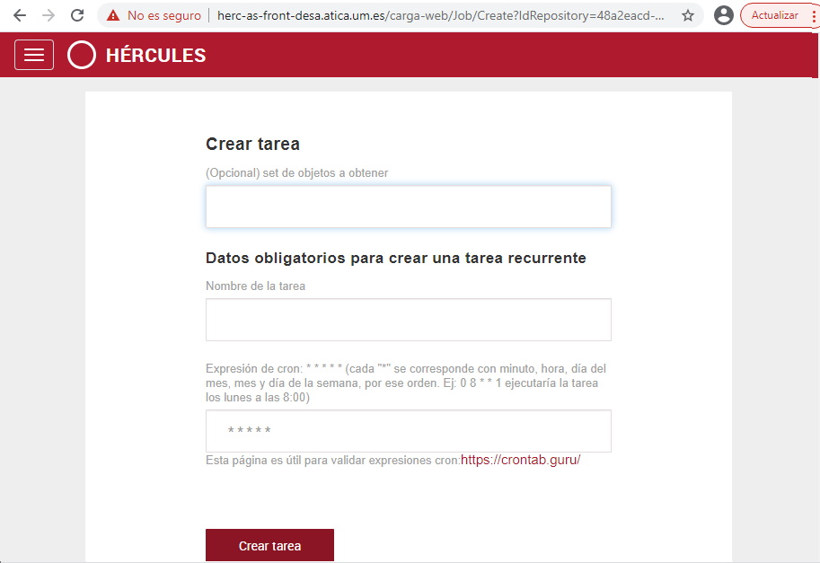
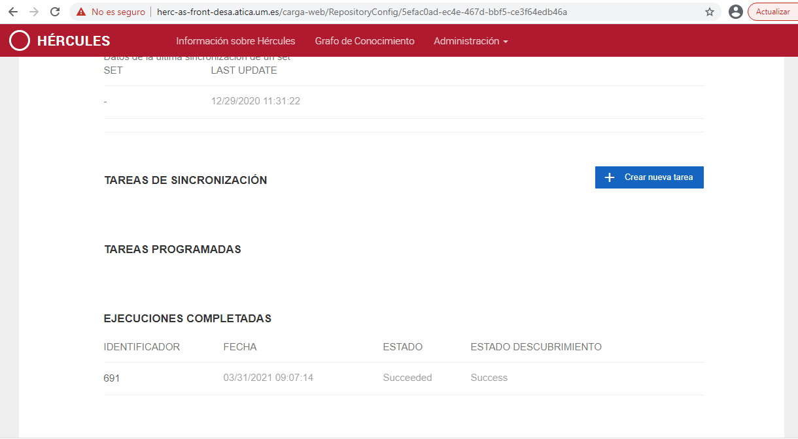
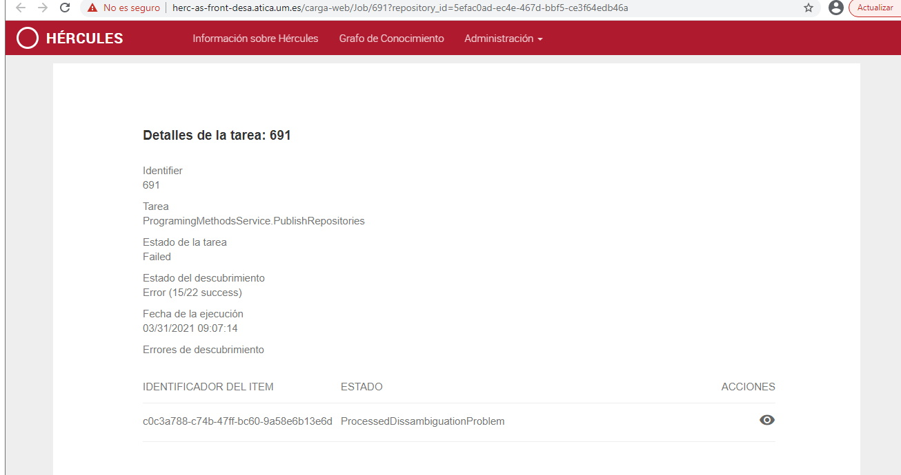
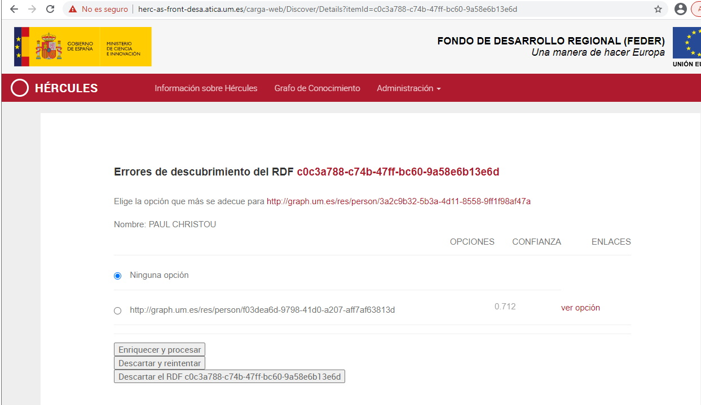
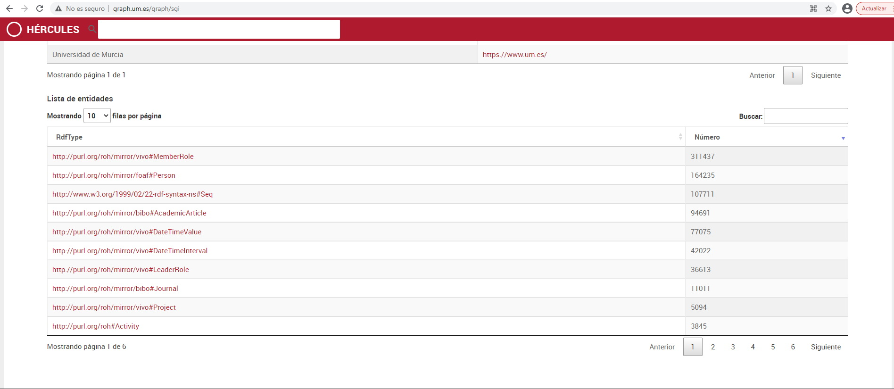

| Fecha         | 31/03/2021                                                   |
| ------------- | ------------------------------------------------------------ |
|Titulo|Hércules ASIO. Test Suite de carga de datos| 
|Descripción|Test Suite de carga de datos|
|Versión|0.1|
|Módulo|Test|
|Tipo|Manual|
|Cambios de la Versión|Creación|

# Hércules ASIO. Test Suite de carga de datos

[1 Introducción](#introducción)

[2 Pasos](#pasos)

[2.1 Vaciar el grafo](#vaciar-el-grafo)

[2.2 Crear repositorios](#crear-repositorios)

[2.3 Sincronizar repositorios](#sincronizar-repositorios)

[2.4 Monitorizar el estado de la carga](#monitorizar-el-estado-de-la-carga)

[2.5 Comprobación de los datos en el grafo](#comprobación-de-los-datos-en-el-grafo)

Introducción
============

Esta carpeta contiene los datos, programas y manuales para la ejecución la ejecución de las pruebas
de carga de datos en la Arquitectura Semántica de ASIO.

Este documento constituye el manual para la ejecución de las pruebas.

La suite de pruebas utilizará las siguientes fuentes de datos:
 - OAI-PMH del SGI. Simula el comportamiento que tendría la actualización desde Hércules SGI y carga 
 las entidades definidas mediante los esquemas XSD con los datos de los ficheros XML, según se indica en
 el proyecto [OAI-PMH de Hércules](https://github.com/HerculesCRUE/oai-pmh). 
 - OAI-PMH para CVNs de la Universidad de Murcia. Carga las entidades de la producción y actividad científica 
 de un investigador, según lo que se puede definir en un cv normalizado (estándar CVN).
 - CERIF de Radboud. Se trata de un repositorio de investigación de la Universidad de Radboud, al que 
 se puede interrogar mediante un servicio OAI-PMH. El servicio contesta con datos en formato CERIF-XML y 
 contiene personas, organizaciones, proyectos, publicaciones y productos (actividades) de investigación.
 
Para ilustrar estos ejemplos se utilizará la instancia instalada en el entorno de desarrollo.
 
Pasos
============

Los pasos para llevar a cabo las pruebas de carga son los siguientes:

Vaciar el grafo
---------------------
Vaciar el grafo en el que se van a cargar los datos en caso de que tenga datos previamente cargados.
Para ello en el sparql endpoint configurado hay que localizar el grafo en el que se va a realizar la carga y vaciarlo mediante la siguiente instrucción:
      
      En el SPARQL endpoint http://155.54.239.204:8890/sparql-auth hay que ejecutar la siguiente instrucción:

      clear graph <http://graph.um.es/graph/sgi>

Crear repositorios
---------------------
Creación del repositorio fuente de datos desde las páginas de administración.

En la url: https://herc-as-front-desa.atica.um.es/carga-web/RepositoryConfig hay que crear los tres repositorios:

- OAI-PMH del SGI. 

- OAI-PMH para CVNs de la Universidad de Murcia. 

 
- CERIF de Radbound.

 
- Así es como debería quedar finalmente una vez dados de alta todos los repositorios:

Sincronizar repositorios
---------------------
Las sincronizaciones de los repositorios de SGI y de CVN se ejecutarán una única vez, ya que sus datos no cambian. Para ello se entrará en la página de ambos repositorios y se pulsará sobre el botón de sincronización:

En el caso del repositorio de la universidad de Radbound se configurarán diferentes tareas de sincronización para sincronizar cada uno de los diferentes elementos que vendrán desde el repositorio OAI-PMH. Para ello desde la página del repositorio se pulsará sobre el botón de crear nueva tarea:

Se crearán 4 tareas diferentes desde la siguiente página:

Para cada tarea hay que especificar el set de objetos a sincronizar, el nombre y la expresión cron que definirá la frecuencia con la que se ejecutará.

El nombre puede ser cualquiera y la expresión cron podría valer 0 9 * * *, que ejecutaría la tarea todos los días a las 9:00 (hora UTC), para los sets hay que utilizar los definidos a continuación:

 Set para proyectos: openaire_cris_projects
 
 Set para publicaciones: openaire_cris_publications
 
 Set para productos: openaire_cris_products
 
 Set para organizaciones: openaire_cris_orgunits

Monitorizar el estado de la carga
---------------------
Para monitorizar el estado de la carga se deberá acceder a l página del repositorio y en la parte inferior se ve el estado de las tareas ejecutadas:

Si se pulsa sobre una tarea en concreto se puede ver el detalle de la tarea:

Y en el caso de que haya algún problema de desambiguación se puede acceder a la página del problema de desambiguación y proceder manualmente:

Comprobación de los datos en el grafo
---------------------
Para comprobar los datos de la carga se pueden realizar consultas SPARQL y/o acceder al Linked Data Server para verificar los datos. 

En el Linked Data Server se pueden buscar las entidades cargadas o se puede acceder a la página del grafo http://graph.um.es/graph/sgi y observar el número de entidades que hay cargadas en el sistema:

