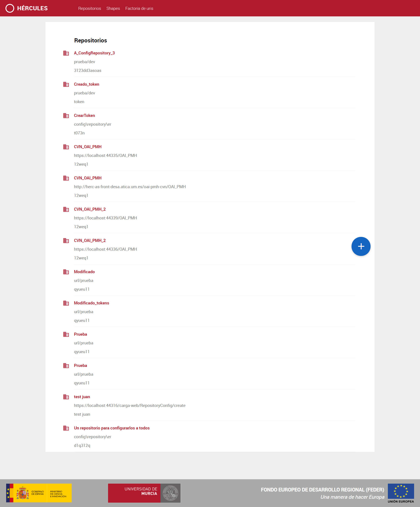
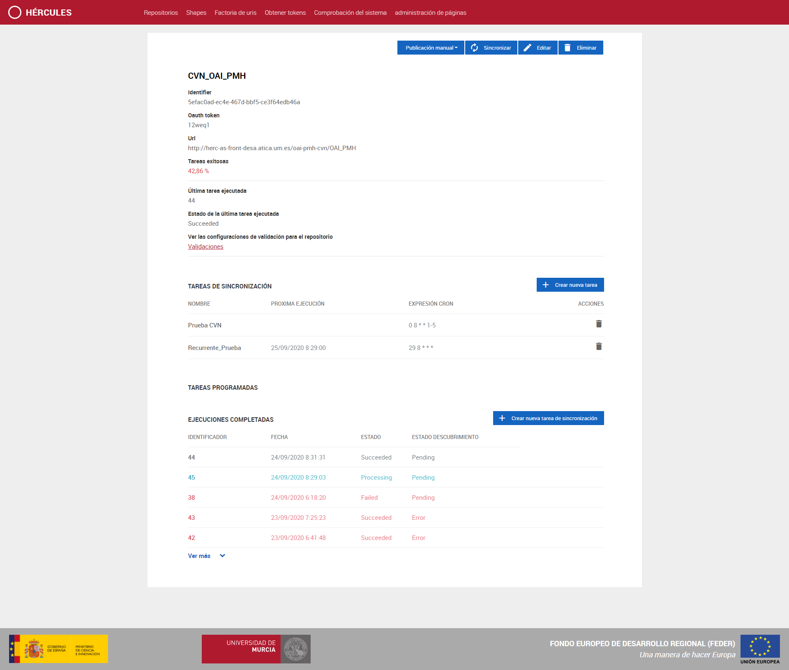
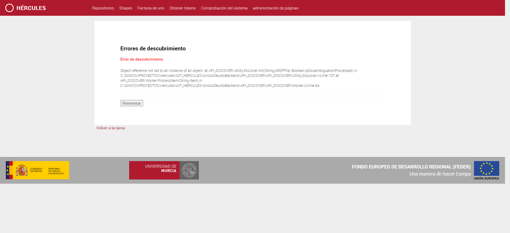
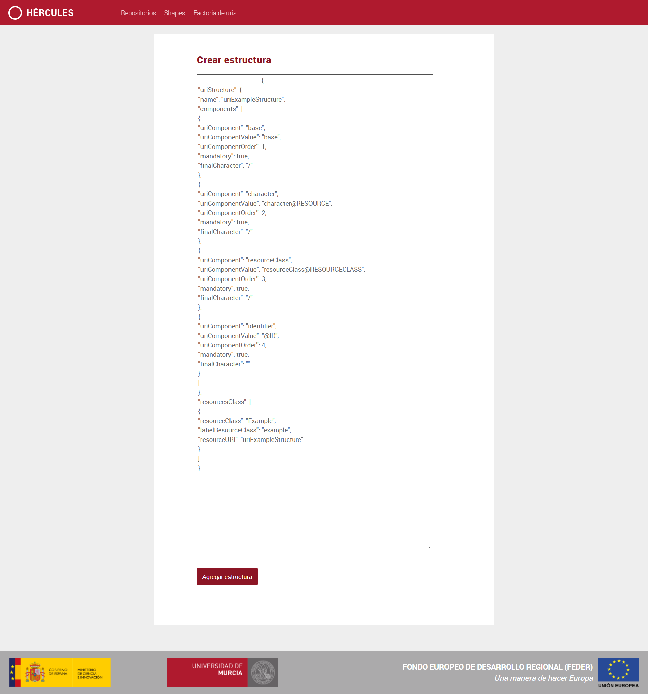
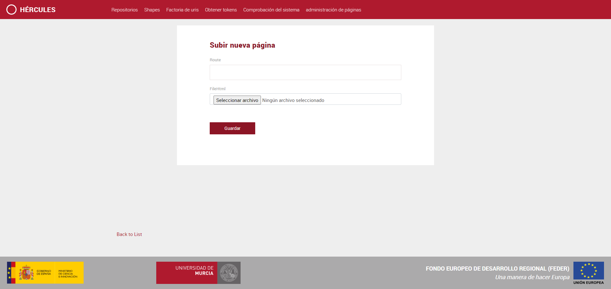

 
| Fecha         | 01/10/2020                                                   |
| ------------- | ------------------------------------------------------------ |
|Titulo|Cambios en el manual de usuario| 
|Descripción|Creación de páginas y modificación|
|Versión|0.3|
|Módulo|FrontEndCarga|
|Tipo|Manual|
|Cambios de la Versión| En está versión se ha añadido un enlace a un manual para la creación de páginas por parte del usuario|
 
 
# Manual de usuario del FrontEnd de Carga

[Introducción](#introduccion)

[Página principal. Listado de repositorios](#página-principal-listado-de-repositorios) 

[Página de un repositorio](#página-de-un-repositorio)

[Configuraciones de validación para un repositorio](#vista-del-listado-de-configuraciones-de-validación-shapes-para-un-repositorio)

[Creación de una tarea](#creación-de-una-tarea)

[Vista de una tarea](#vista-de-una-tarea)

[Vista de una tarea recurrente](#vista-de-una-tarea-recurrente)

[Listado de validaciones](#listado-de-validaciones)

[Factoría de URIs](#factoría-de-uris)

[Publicación y validación de rdf](#publicación-y-validación-de-rdf)

 [Obtención de Tokens](#obtención-de-Tokens)

[Administración de páginas](#administración-de-páginas)

Introducción
------------
Está web es el punto de entrada de los usuarios para administrar sus repositorios. Desde una interfaz intuitiva podrán dar de alta nuevos repositorios, administrarlos y eliminarlos. La primera página que se le muestra al usuario es el listado de repositorios existentes. 

Para cada repositorio el usuario podrá añadir validaciones, tareas programadas y tareas recurrentes. 

Además, desde el menú superior puede acceder también al listado de validaciones (shapes) y a la administración de la factoría de uris, desde donde se podrá administrar los esquemas de URIs. 

Página principal. Listado de repositorios
-----------------------------------------

La página de inicio de la web es el listado de los repositorios. Un repositorio es un origen de datos para ASIO.
Desde este listado se puede crear un repositorio nuevo con el botón "+" que se encuentra por la mitad de la página. 

En el siguiente apartado se muestra la vista de un repositorio. 

Página de un repositorio
-----------------------------------------
Al acceder a un repositorio podemos ver las validaciones configuradas que tiene vinculadas ese repositorio, mediante el enlace que aparece en la sección de Ver las configuraciones de validación para el respositorio, 
así como las tareas de sincronización programadas y el histórico de sincronizaciones ejecutadas que ha tenido. En este histórico aparecen las últimas 5 tareas ejecutadas, para poder ver el resto basta con pulsar en ver más para que se desplieguen el resto de tareas ejecutadas. En esté último apartado en el que se muestran las tareas ejecutadas aparecen dos estados:
 - Estado: Que indica la validación de los rdfs y su posterior encolado para su procesamiento. Pueden aparecer errores de ejecución y de validación de las diferentes configuraciones de validación que tiene el repositorio
 - Estado de descubrimiento: Que indica la publicación de los rdfs y el desambiguamiento de las urls formadas. Pueden aparecer errores de ejecución y de desambiguación de las urls, lo que dará al usuario la opción de elegir la correcta.
 

Desde esta pantalla se pueden crear nuevas sincronizaciones. Además se puede editar o eliminar el repositorio y modificar la
información asociada a él (validaciones y tareas):
 - Eliminar tarea programada.
 - Eliminar tarea recurrente.

Desde la página de un repositorioo también se puede acceder a la información de las tareas, tanto de tareas de ejecución
única como de tareas recurrentes, como se muestra en los apartados siguientes.
Como se ha mencionado anteriormente para acceder a las configuraciones de validación hay un enlace en la sección Ver las configuraciones de validación para el respositorio,
 acontinuación se muestra la vista de configuraciones para un repositorio

Vista del listado de configuraciones de validación (Shapes) para un repositorio
------------------
Un shape es una configuración de validación que se configura en un repositorio y sirve para comprobar que los elementos que se van a sincronizar en el repositorio
tienen una estructura válida.
Desde este vista se muestran los shapes configurados para un repositorio, desde esta página se puede tanto crear un nuevo shape para el repositorio como eliminar, modificar y visualizar uno ya creado.

Creación de una tarea
------------------
Para acceder a este formulario, se puede acceder desde la vista de un repositorio mostrada anteriormente en la parte de la lisata de tareas desde el botón para crear tareas, y aparece el siguiente formulario
para crear una tarea asociada al repositorio.

Los datos a introducir en este formulario son:
 - **Fecha de inicio:** fecha a partir de la cual se ejecutará.
 - **fecha de última sincronización:** fecha a partir de la cual se debe actualizar. Opcional.
 - **Set:** tipo del objeto, usado para filtrar por agrupaciones, este parametro se puede obtener de http://herc-as-front-desa.atica.um.es/carga/etl/ListSets/{identificador_del_repositorio}.Opcional.
 - **Código de objeto:** codigo del objeto a sincronizar, es necesario pasar el parametro set si se quiere pasar este parámetro, este parametro se puede obtener en la respuesta identifier que da el método http://herc-as-front-desa.atica.um.es/carga/etl/ListIdentifiers/{identificador_del_repositorio}?metadataPrefix=rdf. Opcional.
 - **Nombre del trabajo:** Nombre que se le va a dar a la tarea de sincronización. Obligatorio para tarea recurrente.
 - **Expresión del cron:** Recurrencia de la tarea. Obligatorio para tarea recurrente.

Desde esta interfaz se pueden crear varios tipos de tarea según los datos que se introduzcan:
 - **Tarea recurrente:** Para crear este tipo de tarea es necesario rellenar los campos obligatorios para crear una tarea de recurrencia como nombre del trabajo y expresión del cron,
a su vez se puede dejar vacía la fecha de inicio o poner la fecha actual para que la tarea recurrente este activa desde el primer instante. 
*Una tarea se le denomina recurrente cuando tiene una repeteción o recurrencia a través de un patrón. Por ejemplo que se ejecute todos los lunes a las 8 de la mañana*.
 - **Tarea programada:** Para crear esta tarea basta con poner la fecha de inicio en una fecha futura, en el caso de que se introduzcan también los datos para crear una tarea
 recurrente esta no será valida hasta el momento que se ejecute la tarea en la fecha futura especificada. *Una tarea se le denomina programada cuando está configurada para 
 ejecutarse en un momento en el futuro*.
 - **Tarea/tarea de ejecución única:** Para crear este tipo de tare basta con dejar vacía la fecha de inicio o poner la fecha actual para que la tarea recurrente este activa desde el primer instante,
 si no pasará a ser una tarea programada. *Una tarea se le denomina de ejecución única cuando se ejecuta una sola vez en el momento de su creación o cuando se ha ejecutado ya, con esto último lo que 
 se quiere decir que una tarea recurrente cada vez que se ejecuta crea tareas de única ejecución al igual que una tarea programada cuando pasa a ser ejecutada ejecuta una tarea de ejecución única*.
 
Vista de una tarea
------------------
Se denomina una tarea a la programación de una sincronización de un repositorio. Cuando está sincronización 
se realiza, esta tarea pasa a ser una tarea ejecutada. 

En la pantalla que se muestra a continuación se muestran los datos de una tarea ejecutada
y un botón con el cual se puede volver a lanzar. Los datos mostrados son:
 - Identificador de la tarea.
 - La tarea ejecutada.
 - El estado de la tarea, que puede ser que se haya ejecutado con éxito o esté en estado fallido.
 - La fecha de la ejecución en formato UTC.
 - Error que haya causado el fallo de la tarea, en el caso de que haya ocurrido algún error.
 - Errores en el descubrimiento, pueden ser del tipo error, los cuales se pueden volver a reintentar o ProcessedDissambiguationProble, que requieren la intervención del usuario.

Vista de una tarea con errores de descubrimiento:

En está vista se ve que tenemos un error asociado a la tarea de ejecución en el descubrimiento y otro de desambiguación que requiere la intervención del usuario, a continución se muestrán las vistas de
estos errores.
En la siguiente imágen se muestra un error de ejecución que se haya podido dar por un error puntual, se puede volver a lanzar pulsando el botón de reintentar.

A continuación se muestra un error en el que se requiere la intervención del usuario eligiendo la opción que sea correcta enter las opciones disponibles o no elegir ninguna opción
en el caso de que no sea ninguna la opción correcta. En esta pantalla se muestra la confianza de las opciones siendo 1 la más alta, además se puede visualizar los datos de 
las diferentes opciones desde el enlace que hay en ver opción.

Vista de una tarea recurrente
-----------------------------

Cuando se habla de una tarea recurrente, se habla de una programación de sincronización sobre un repositorio que 
tiene una repetición a lo largo del tiempo, esta repetición o recurrencia viene dada por la expresión del cron
configurada en esta tarea recurrente.
En la siguiente imágen se muestran los datos de una tarea recurrente:
 - El nombre de la tarea recurrente.
 - La expresión del cron que indica la recurrencia de dicha tarea.
 - La fecha de la próxima ejecución.
 - El identificador de la última tarea ejecutada, en el caso de que se haya ejecutado alguna tarea.
 - El estado de la última tarea ejecutada, en el caso de que se haya ejecutado alguna tarea.
 - Por último se muestra un listado de las tareas ejecutadas a partir de la tarea recurrente.
 

Listado de validaciones
-----------------

Para obtener más información de los validaciones puedes consultar: https://github.com/HerculesCRUE/GnossDeustoBackend/tree/master/API_CARGA/Validaciones
Desde esta página se muestra el listado general de validaciones. Desde este listado se puede acceder al detalle de una validación concreta. 

Para poder acceder a su información y poder editarla o eliminar el shape tendremos que acceder a él.

Factoría de URIs
----------------

Para acceder a la información explicativa sobre las uris y el esquema de uris se puede acceder desde: https://github.com/HerculesCRUE/GnossDeustoBackend/tree/master/UrisFactory
Interfaz desde la que se puede:
 - Obtener un URI.
 - Descargar el archivo el archivo de configuración de los URIs.
 - Reemplazar el archivo de configuración de URIs.
 - Eliminar una estructura de URIs.
 - Añadir una nueva estructura de URIs.
 
 
 
 En la pantalla anterior solo aparece la opción de obtener una uri, en el tipo de dato hay que especificar si en el parámetro resource_class se le está pasando un resource_class (por defecto) o un 
 Rdf type, para acceder a las operaciones concernientes al esquema de uris hay que pinchar en Esquema de uris que llevará a la siguiente imágen
 
 
 
 A la hora de crear una estructura URI nos mostrará un texto editable en el que aparece una
 estructura a modo de ayuda, como se ve en la siguiente imágen:
 

Publicación y validación de rdf
----------------
Se accede desde la vista de detalles de un repositorio, desde la parte superior donde aparece la opción publicación manual, se despliega un menú con 3 opciones.
 - Obtener el rdf de un repositorio.
 - Validar un rdf propio o descargado del propio repositorio, tanto por medio de un rdf de validación propio como por los shapes configurados en el propio repositorio.
 - Publicar un rdf, pasando antes por los sahpes configurados en el repositorio.
Cuando se obtenga un error de validación se mostrará una página de error como la que aparece a continuación.

Error de validación:

Obtención de Tokens
----------------
Desde esta interfaz se pueden obtener los tokens de las diferentes aplicaciones que habrá que pegar en las diferentes apis para poder usar la interfaz swagger de cada api

Administración de páginas
----------------
Desde esta interfaz se pueden consultar lás páginas que han sido creadas por el usuario, eliminarlas, editarlas y crearlas gracias al botoón + que aparece en el listado.

Al pulsar el botón + aparecerá un formulario para crear páginas con contenido HTML estático con una ruta dada para poder consultar estas páginas en el futuro y un campo para subir el html.
**Importante que la ruta introducida empiece por /**

A continuación se muestra un ejemplo de una página creada mediante este formulario, con la url /public/gnossdeustobackend/index

Podemos encontrar un pequeño manual de creación de páginas en: https://github.com/HerculesCRUE/GnossDeustoBackend/blob/master/FrontEndCarga/Manual%20de%20creacion%20de%20paginas.md