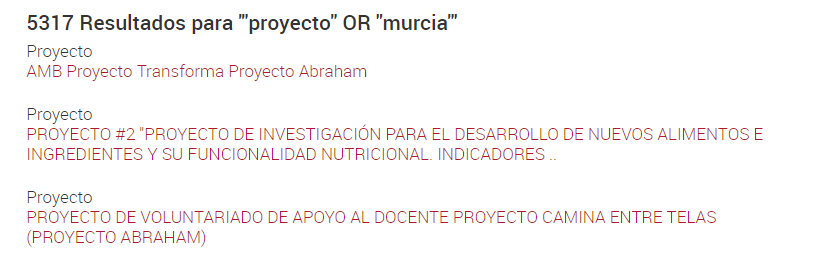
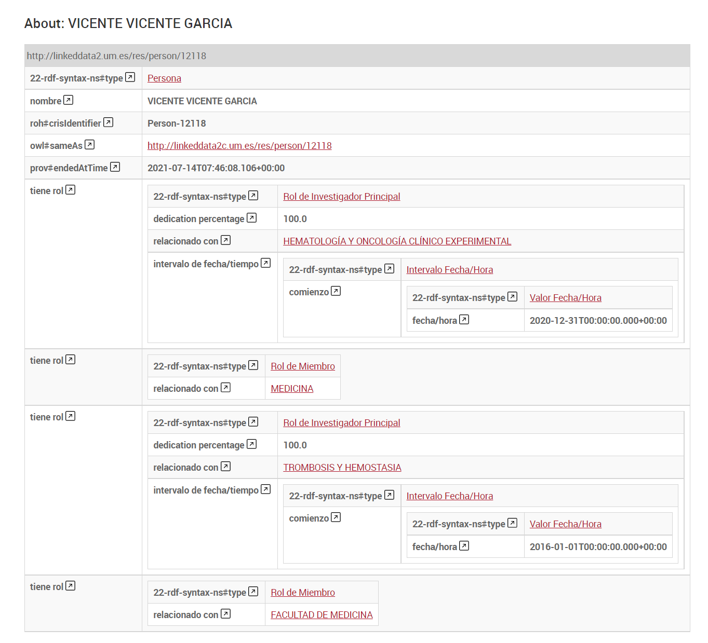
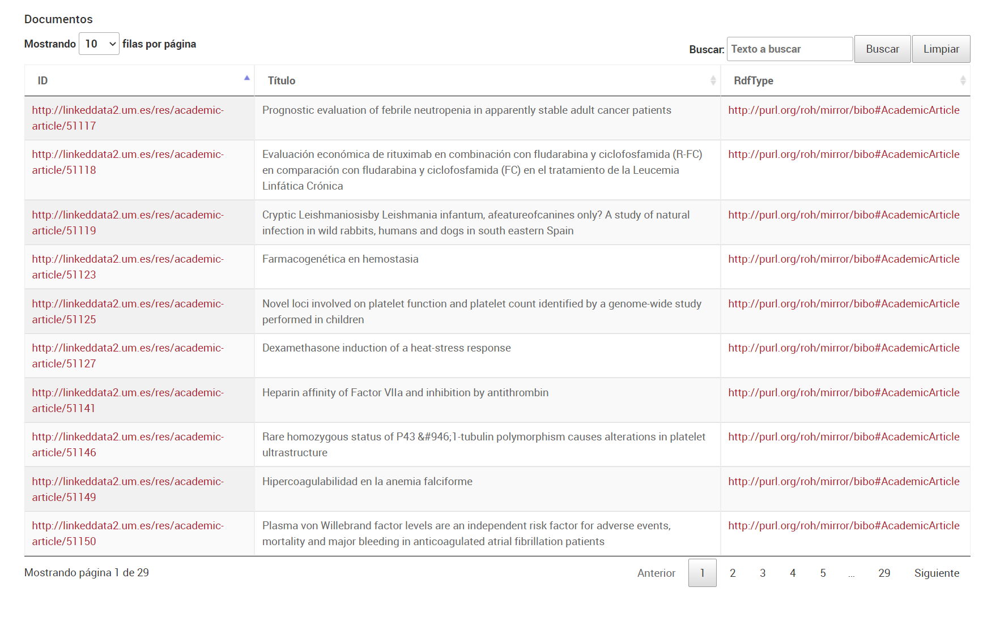

| Fecha         | 23/07/2021                                                 |
| ------------- | ------------------------------------------------------------ |
|Titulo|LINKED DATA SERVER| 
|Descripción|Manual del servicio LINKED DATA SERVER|
|Versión|1.2|
|Módulo|API DISCOVER|
|Tipo|Manual|
|Cambios de la Versión|Añadida la sección 'Búsqueda por texto libre'|

[](https://sonarcloud.io/dashboard?id=LinkedDataServer)


[](https://codecov.io/gh/HerculesCRUE/GnossDeustoBackend)
[](https://sonarcloud.io/dashboard?id=LinkedDataServer)
[](https://sonarcloud.io/dashboard?id=LinkedDataServer)
[](https://sonarcloud.io/dashboard?id=LinkedDataServer)
[](https://sonarcloud.io/dashboard?id=LinkedDataServer)

[](https://dotnetfoundation.org/projects?searchquery=IdentityServer&type=project)

## LINKED DATA SERVER de ASIO

[Introducción](#introducción)

[Ejemplos de resolución de URIs](#ejemplos-de-resolución-de-uris) 

[Búsqueda por texto libre](#búsqueda-por-texto-libre) 

[Conexión a Triple Store](#conexión-a-triple-store)

[Configuración de appsettings.json](#configuración-de-appsettingsjson)

[Configuración de Linked Data Server](#configuración-de-linked-data-server)

[Vista de las fichas](#vista-de-las-fichas)

[Dependencias](#dependencias)


Introducción
------------

LINKED DATA SERVER es un componente de ASIO desarrollado en .Net Core que proporciona el servicio de datos enlazados de Hércules ASIO.

En la ejecución del proyecto se ha optado por el desarrollo de un componente propio, en lugar de integrar desarrollos existentes de software abierto, como [Trellis](https://www.trellisldp.org/) o [Trifid](https://zazuko.com/products/trifid/), por tres motivos.

En primer lugar, las soluciones analizadas están desarrolladas con lenguajes y entornos distintos a .Net Core. Integrar un componente Linked Data Server desarrollado con otro _stack_ tecnológico no habría sido un gran obstáculo pero, en lo posible, hemos preferido mantener la homogeneidad tecnológica.

En segundo, el uso de estos servicios tampoco era inmediato ni trivial, sino que habría requerido de unos tiempos de análisis, personalización y configuración relevantes, especialmente si hay que mostrar datos con una cierta profundidad en sus relaciones, como sucede en muchas entidades de la ontología ROH.

Finalmente, tenemos el proceso de descubrimiento, que tiene que ofrecer al usuario administrador de la plataforma un interfaz con el que comparar los datos en carga con los existentes, para el caso en el que el descubrimiento no alcance el nivel de confianza que le permita decidir si una entidad en carga coincide o no con una existente. Estos datos en carga se deberían consultar del mismo modo en que ASIO permite la consulta de los datos de una entidad existente, es decir, con el interfaz del servicio Linked Data. El problema es que los desarrollos revisados no permiten la presentación de datos RDF arbitrarios (como serían los de las entidades en carga) sino que trabajan con fuentes de datos existentes. En este punto teníamos dos opciones: generar un servicio que permitiera la visualización de datos RDF arbitrarios a partir del código de un servicio Linked Data existente, con un lenguaje y arquitectura distinto al del resto del proyecto; o desarrollar un servicio propio de visualización de RDF. Descartamos la primera opción porque el tiempo de desarrollo no habría sido menor y habría añadido complejidad a nuestro desarrollo, y decidimos generar un visualizador de RDF arbitrario para el proceso de descubrimiento.

Por tanto, ya que íbamos a tener un visualizador de RDF y que la integración de otros servidores Linked Data tampoco hubiera sido trivial, decidimos generar un Linked Data Server de ASIO , coherente con la tecnología y arquitectura general del proyecto.

El Linked Data Server de ASIO, desarrollado en tecnologías .Net Core, quedará disponible para la comunidad de desarrolladores como un software abierto y reutilizable en cualquier otro proyecto de Linked Data que necesite un servicio desarrollado en el _stack_ tecnológico de Microsoft.

El Linked Data Server de ASIO cumple la especificación LDP:
[Hércules Backend ASIO. Evaluación de cumplimiento Linked Data Platform (LDP)](../../Docs/Hercules-ASIO-Evaluacion-de-cumplimiento-Linked-Data-Platform.md)
 
Ejemplos de resolución de URIs
-----------------------

Se puede comprobar el funcionamiento del servidor mediante los siguientes ejemplos:
- [http://linkeddata2.um.es/res/person/124](http://linkeddata2.um.es/res/person/124) Investigador con publicaciones y código ORCID.
- [http://linkeddata2.um.es/res/academic-article/77681](http://linkeddata2.um.es/res/academic-article/77681) Artículo científico.
- [http://linkeddata2.um.es/res/project/15335](http://linkeddata2.um.es/res/project/15335) Proyecto de investigación.


Búsqueda por texto libre
-----------------------

Para las búsquedas por texto libre se ha utilizado la función bif:contains de Virtuoso, si se utilizase otro RDF Store habría que modificar la query que se realiza dentro del controlador [SearchController](../Hercules.Asio.LinkedDataServer/Linked_Data_Server/Controllers/SearchController.cs). 

Se pueden realizar búsquedas de dos formas:
- Sin introducir comillas dobles al inicio y al fin del texto a buscar: Realizará una búsqueda en la que encontrará todas las entidades que contengan todas las palabras introducidas (sin importar el orden). En la práctica al introducir en el buscador el texto **proyecto murcia** se realiza la siguiente instrucción **bif:contains '"proyecto" AND "murcia"'**.


- Introduciendo comillas dobles al inicio y al final del texto a buscar: Realizará una búsqueda en la que encontrará todas las entidades que cumplan la expresión introducida. En la práctica se realiza la siguiente instrucción **bif:contains 'texto_introducido'**. 
	
Por lo que se podría utilizar para realizar una búsqueda de un texto completo concreto si únicamente se introducen las comillas al inicio y al final. Por ejemplo, al introducir el texto **"proyecto murcia"**  se realiza la siguiente instrucción **bif:contains '"proyecto murcia"'**.
	


O se pueden usar expresiones como OR para realizar búsquedas. Por ejemplo, al introducir el texto **"proyecto" OR "murcia"**  se realiza la siguiente instrucción **bif:contains '"proyecto" OR "murcia"'**.
	



*Conexión a Triple Store*
-------------------------

Como no es necesario ningún conector específico para consultar un RDF Store ya que, por definición, deben tener un SPARQL Endpoint, no se ha creado ninguna librería específica de conexión al RDF Store.

El SPARQL Endpoint provisional se encuentra disponible en un servidor de la Universidad de Murcia, con acceso protegido por una VPN en la siguiente URL:

http://155.54.239.204:8890/sparql

## Configuración de appsettings.json
Este es el fichero de configuración general del servicio en el que se establecen las configuraciones referentes al endpoint SPARQL y otrsa configuraciones generales

    {
		"Logging": {
			"LogLevel": {
				"Default": "Information",
				"Microsoft": "Warning",
				"Microsoft.Hosting.Lifetime": "Information"
			}
		},
		"AllowedHosts": "*",
		"Sparql": {
			"Graph": "",
			"Endpoint": "http://127.0.0.1:8890/sparql",
			"QueryParam": "query"
		},
		"Sparql1": {
			"Endpoint": "http://127.0.0.1:8890/sparql",
			"XAppServer": "1"
  		},
		"Sparql2": {
			"Endpoint": "http://127.0.0.1:8890/sparql",
			"XAppServer": "2"
  		},
		"LogPath": "",
		"OntologyGraph": "http://graph.um.es/graph/research/roh",
		"NameTitle": "Hércules",
		"ConstrainedByUrl": "",		
		"UrlHome": "https://herc-as-front-desa.atica.um.es/carga-web"
	}

Las opciones de configuración son: 
 - LogLevel.Default: Nivel de error por defecto
 - LogLevel.Microsoft: Nivel de error para los errores propios de Microsoft
 - LogLevel.Microsoft.Hosting.Lifetime: Nivel de error para los errores de host
 - LogPath: Ruta en la que escribir los logs
 - Sparql.Graph: Grafo en el que se van a consultar los triples
 - Sparql.Endpoint: URL del Endpoint Sparql (HAPRoxy en caso de que haya replicación)
 - Sparql.QueryParam: Parámetro para la query en el Endpoint Sparql
 - Sparql1: Datos de configruación del endpoint 1, en caso de que haya replicación (no es obligatorio)
 - Sparql1.Endpoint: URL del Endpoint Sparql 1
 - Sparql1.XAppServer: Nombre devuelto en la cabecera 'X-App-Server' del HAProxy para el Endpoint Sparql 1
 - Sparql2: Datos de configruación del endpoint 1, en caso de que haya replicación (no es obligatorio)
 - Sparql2.Endpoint: URL del Endpoint Sparql 2
 - Sparql2.XAppServer: Nombre devuelto en la cabecera 'X-App-Server' del HAProxy para el Endpoint Sparql 2
 - OntologyGraph: Grafo del Endpoint Sparql en el que está cargada la ontología
 - NameTitle: Nombre para mostrar en el título de la página tras el nombre de la entidad
 - ConstrainedByUrl: Url en la que se encuentran las restricciones ConstrainedBy 
 - UrlHome: Url con la que enlazar el logo de la cabecera 'Hércules'

## Configuración de Linked Data Server

El fichero con las opciones de configuración es [Linked_Data_Server_Config.json](./Linked_Data_Server/Config/Linked_Data_Server_Config.json). En este fichero se definen las las personalizaciones a aplicar en las fichas de las entidades en función de su rdf:type

Si la entidad tiene una personalización en el fichero de configuración, se renderiza del siguiente modo:
- Atributos directos de la entidad, que se renderizan para todos los tipos de entidades. Por ejemplo, en la ficha del investigador serían:



- Tablas configuradas que muestran datos relacionados con la entidad. Por ejemplo, los artículos de un investigador:



- Grafos configurados que muestran relacionados con otras entidades. Por ejemplo, los investigadores con los que un investigador publica:


- Por último, datos de entidades relacionadas, siempre que el tipo de la entidad no esté incluido en la opción "ExcludeRelatedEntity" del fichero Linked_Data_Server_Config.json, como sucede con los investigadores.

En resumen, las opciones de configuración del fichero [Linked_Data_Server_Config.json](./Linked_Data_Server/Config/Linked_Data_Server_Config.json) son: 
 - ConfigTables: En esta sección se definen las tablas que se mostrarán en la fichas de la entidades en función de los siguientes parámetros:
 	- ConfigTables.rdfType: rdf:type de las entidades a las que afectará esta configuración.
 	- ConfigTables.tables: Tablas que se mostrarán en las entidades que tengan el rdf:type especificado en el punto anterior.
 		- ConfigTables.tables.name: Nombre de la tabla a mostrar.
 		- ConfigTables.tables.fields: Nombre de los campos a mostrar en la tabla.
 		- ConfigTables.tables.query: Consulta que obtiene los datos a mostrar en la tabla.
		
 - ExcludeRelatedEntity: rdf:type de las entidades en las que queramos que no se incluya la sección 'Entidades relacionadas'

 - ConfigArborGraphs: En esta sección se definen los gráficos de grafo que se mostrarán en la fichas de la entidades en función de los siguientes parámetros:
	 - ConfigArborGraphs.icons: Icono a mostrar en el gráfico según su rdf:type
		- ConfigArborGraphs.icons.rdfType: rdf:type de la entidad a la que se le quiere aplicar el icono.
		- ConfigArborGraphs.icons.icono: Icono a mostrar en el gráfico según su rdfType.
	- ConfigArborGraphs.arborGraphsRdfType: Configuración de los gráficos de grafo en función del rdf:type.
		- ConfigArborGraphs.arborGraphsRdfType.rdfType: rdf:type de las entidades a las que afectará esta configuración.
		- ConfigArborGraphs.arborGraphsRdfType.arborGraps: Gráficos que se mostrarán en las entidades que tengan el rdf:type especificado en el punto anterior.
			- ConfigArborGraphs.arborGraphsRdfType.arborGraps.name: Nombre del gráfico a mostrar
			- ConfigArborGraphs.arborGraphsRdfType.arborGraps.properties: Propiedades a mostrar en el grafo
			- ConfigArborGraphs.arborGraphsRdfType.arborGraps.properties.name: Nombre de la propiedad
			- ConfigArborGraphs.arborGraphsRdfType.arborGraps.properties.query: Consulta que obtiene los datos a mostrar en el gráfico

 - PropsTitle: Propiedades de la ontología para utilizar como título de las entidades en la presentación de la web. Generalmente http://purl.org/roh/mirror/foaf#name para las personas y http://purl.org/roh#title para el resto de entidades
 - PropsTransform: Propiedades que serán transformadas en la visualizació de las fichas de las entidades, como vemos en el ejemplo siguiente para mostrar ORCID como un enlace.
 	- PropsTransform.property: Propiedades cuya presentación en la web se transforma. Se visualizarán transformadas como enlaces externos según lo especificado en PropsTransform.transform. Por ejemplo, que un código ORCID se presente como un enlace se declara del siguiente modo:
 	- PropsTransform.transform: Las propiedades especificadas en PropsTransform.property se visualizarán como un hipervínculo en la web según lo especificado en esta configuración


```
    {
        "property": "http://purl.org/roh#ORCID",
        "transform": "https://orcid.org/{value}"
    },
```


## Vista de las fichas

La vista que se utiliza para la presentación de las entidades del Linked Data Server es la siguiente: https://github.com/HerculesCRUE/GnossDeustoBackend/blob/master/src/Hercules.Asio.LinkedDataServer/Linked_Data_Server/Views/Home/Index.cshtml

## Dependencias

- **dotNetRDF**: versión 2.6.0
- **Marvin.Cache.Headers**: versión 5.0.1
- **Microsoft.AspNetCore.Http.Extensions**: versión 2.2.0
- **Serilog.AspNetCore**: versión 3.4.0
