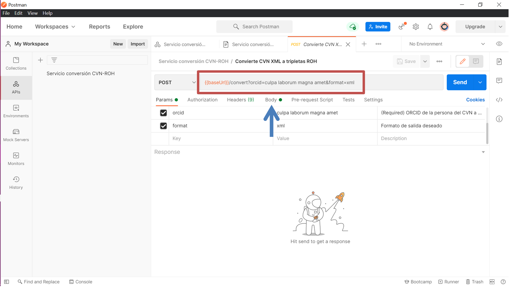

| Fecha         | 8/2/2021                                                   |
| ------------- | ------------------------------------------------------------ |
|Titulo|Servicio conversor de XML CVN a triples ROH| 
|Descripción|Especificación del servicio conversor de XML CVN a triples ROH|
|Versión|1.1|
|Módulo|API Carga|
|Tipo|Especificación|
|Cambios de la Versión|Reordenación de la documentación y cambio de rutas|


<!--Servidor HTTP que ofrece una API para convertir XML CVN a tripletas ROH.

http://herc-as-front-desa.atica.um.es:8080/v1/ui/#/default/convert_post-->

# Instalación

Requisitos:

- Python 3
- Pipenv

Instalamos con Pipenv (son imprescindible las dos ordenes):

```bash
$ pip install pipenv
$ pipenv install
```

# Ejecución del servicio

Ejecutar un servidor en el puerto por defecto (`5000`) y con el modo `debug` desactivado:

```bash
$ pipenv run python3 -m cvn.webserver
```
# Realizar el request

Se recomienda usar el programa Postman (https://www.postman.com/). Seguir los siguientes pasos ilustrados con imágenes:
* Para poder utilizar la API de conversión CVN desde esta aplicación, 
    * Hay que importar una nueva api (aplicando al botón que se ve en flecha roja de la siguiente imagen). 
    * Se abre un menú de opciones que son las que se observan en la imagen y se debe seleccionar `Folder` (flecha azul). 
    * Seleccionar en la opción anterior `Choose folder from your computer`, y se deberá seccionar la carpeta `docs`. Selecionar importar la api que encuentra de manera automática. 


* Una vez realizado este paso, Postman te permite darle los datos para la petición POST. En la siguiente imagen se muestra el aspecto de Postman al terminar el paso anterior. La flecha roja muestra nuestra api. Para poder pasarle los datos se deberá clicar al enlace que señala la fecha azul. 
 


* Se debera clicar el enlace de `Open Request` señalado con la fecha azul. 


* Una  vez realizado todos los pasos anteriores, de debe ejecutar el servidor (explicado en la sección anterior).

* Volviendo a Postman, hay que realizar la petición POST a la cual hay que pasarle los datos, deseados. Para ello:
    * En la URL  que aparece en el rectángulo rojo, hay que insertar el ORCID y el formato deseado. Este URL tiene la siguiente forma, donde los parámetros ORCID y FORMATO pueden ser diferentes en cada petición realizada. Se deberá sustituir por los datos deseados. Ejemplificando.  
    ```{{baseUrl}}/convert?orcid=ORCID&format=FORMATO``` --> ```{{baseUrl}}/convert?orcid=0000-0001-8055-6823&format=xml```



* Una vez cambiado la URL se deberá clicar en el botón `body`, el resultado de esta acción se muestra en la siguiente imagen.
    * Se debe clicar en la opción `binary` (flecha roja). 
    * Clicar en `Select File` y seleccionar el archivo xml que contiene el CVN que se desea transformar en tripletas. Es importante tener en cuenta que estas tripletas seran compatibles con la ultima versión de [ROH](https://github.com/HerculesCRUE/ROH/tree/gh-pages).
    * Llegado a este punto ya se le han pasado todos los datos a la petición POST y se ha activado el servidor por lo que únicamente hace falta realizar la petición clicando el botón `Send` (flecha verde).
    
 


* Con el fin de ejemplificar el resultado, en la siguiente imagen se muestra como aparece el resultado de la conversión del xml que se encuentra en la carpeta de Ejemplos con nombre  cv1.xml. y como URL se utilizó la anteriormente ejemplificada y que se observa en la imagen anterior. El resultado es el siguiente


## Configuración

Es posible configurar el puerto de ejecución con el parámetro `-p`.  Si no se especifica nada, el puerto por defecto es `5000`. 
En el siguiente ejemplo, se ejecutará el servidor en el puerto `80`.

```bash
$ pipenv run python3 -m cvn.webserver -p 80
```
> Recomendable usar en Windows `python` en vez de `python3`. 

Si se incluye el argumento `-h`, se mostrará la ayuda:

```text
usage: webserver.py [-h] [-p] [--host HOST] [--debug]

Servidor HTTP que ofrece una API para convertir XML CVN a tripletas ROH

optional arguments:
  -h, --help    show this help message and exit
  -p , --port   El puerto en el que se ejecutará el servidor HTTP (por defecto
                5000)
  --host HOST   El host donde se bindeará el servidor HTTP (por defecto
                127.0.0.1)
  --debug       DEBUG: activar modo debug (aumenta tiempo de ejecución)
```

Si queremos que el servidor escuche en `0.0.0.0`, añadimos el argumento `--host 0.0.0.0`.

# Endpoints

## `/v1/convert`

- Método: `POST`

Parámetros:

| key | ¿Obligatorio? | descripción |
|:--|:--|:--|
| `orcid` | Sí | La ORCID de la persona de la que es el CVN.<br>Ejemplo: `0000-0001-8055-6823`
| `format` | No | Valor por defecto: `xml`<br>Posibles formatos: <ul><li>`xml`</li><li>`n3`</li><li>`turtle`</li><li>`nt`</li><li>`pretty-xml`</li><li>`trix`</li><li>`trig`</li><li>`nquads`</li></ul>

El contenido del archivo que queremos debe enviarse como el cuerpo, en codificación binaria (ver ejemplos más abajo) y estando en UTF-8.

### Posibles errores

- `An xml file is required as binary body data.` \
    No se está enviando bien el archivo, ver ejemplos más abajo. Debe ser el cuerpo de la solicitud.

- `The orcid parameter is required.` \
    El parámetro ORCID debe ser indicado como un parámetro HTTP más, y es obligatorio.

- `The orcid field has an invalid format.` \
    El ORCID indicado no sigue el formato. Ejemplo de ORCID: `0000-0001-8055-6823`. 
    El RegEx que usa el programa es [`0000-000(1-[5-9]|2-[0-9]|3-[0-4])\d{3}-\d{3}[\dX]`](https://regex101.com/r/w6sa8Q/2)

- `The format field has an unsupported format.` \
	El parámetro format tiene un valor fuera de los permitidos. Ver tabla más arriba para una lista completa de los formatos soportados.

- `Error while parsing the XML.` \
    El XML no es válido o no ha sido posible procesarlo (ej.: extremadamente grande)

### Ejemplos de consultas

#### curl

Suponiendo que el servidor está en `127.0.0.1:5000`, la siguiente llamada usando la utilidad de consola `curl` convertirá
el archivo en `examples/cvn_202033-Diego.xml`

```bash
curl --location --request POST 'http://127.0.0.1:5000/v1/convert?orcid=0000-0001-8055-6823' \
--header 'Content-Type: application/x-www-form-urlencoded' \
--data-binary '@examples/cvn_202033-Diego.xml'
```

> Recomendable usar en Windows `"` en vez de `'`, el comando sería:
> `curl --location --request POST "http://127.0.0.1:5000/v1/convert?orcid=0000-0001-8055-6823" --header "Content-Type: application/x-www-form-urlencoded" --data-binary "@examples/cvn_202033-Diego.xml"`

#### C# - RestSharp

Similar a la de `curl`.  
(sustituyendo `<contenido del archivo aquí>` por el contenido del archivo que queremos convertir)

```cs
var client = new RestClient("http://127.0.0.1:5000/v1/convert?orcid=0000-0001-8055-6823");
client.Timeout = -1;
var request = new RestRequest(Method.POST);
request.AddHeader("Content-Type", "application/x-www-form-urlencoded");
request.AddParameter("application/x-www-form-urlencoded", "<contenido del archivo aquí>", ParameterType.RequestBody);
IRestResponse response = client.Execute(request);
Console.WriteLine(response.Content);
```
<!---
 # Ejecución de la documentación de la API

Existe un servidor de OpenAPI que va incluido en los archivos. Tiene los mismos requisitos que la API. Podemos ejecutarlo de la siguiente manera:

```bash
$ cd docs/api/flask
$ pipenv install
$ pipenv run python3 -m openapi_server
```

Se puede acceder desde la siguiente URL:

http://localhost:8080/v1/ui

Se puede ejecutar a la vez que la API abriendo otra terminal nueva (en Windows, una nueva ventana)-->
